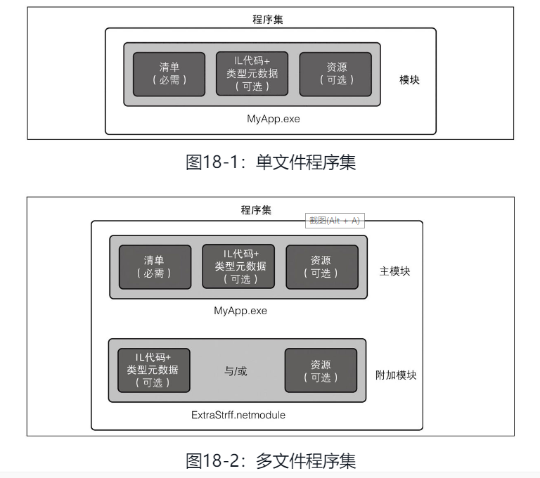

# 1. 反射基础

## 1. 说明

### 1.1 关于反射、特性

在 《C\# 7.0 本质论》中，关于这方面的知识在 《第十八章 反射、特性和动态编程》；在《C\# 7.0 核心技术指南》中，这部分内容在《第19章 反射和元数据》。


\[图片来自 《C\# 7.0 本质论》\]

在这里我们可以获得一些关联性很大的技术：反射、特性、元数据；

**元数据**：C\# 编写的程序编译成一个程序集，程序集会包含元数据、编译代码和资源。 元数据包含内容：

* 程序或类库中每一个类型的描述；
* 清单信息，包括与程序本身有关的数据，以及它依赖的库；
* 在代码中嵌入的自定义特性，提供与特性所修饰的构造有关的额外信息。

**反射**：在运行时检查并使用元数据和编译代码的操作称为反射。

一个程序集包含的内容：



\[图片来自 《C\# 7.0 核心技术指南》\]

## 2. 程序集操作

C\# 编译成的代码会生成到 .dll 或 .exe 文件中，我们可以通过 Assembly 类，手动加载 程序集文件，实现各种操作。

Assembly 类在 `System.Reflection` 命名空间中。

《C\# 7.0 核心技术指南》中，列出类 Assembly 类常用的属性和方法：


接下来我们将通过代码操作，了解 Assembly 的使用方法。

创建一个控制台项目，并设置程序集描述信息。


### 2.1 获取 程序集对象（Assembly）

微软官方文档建议使用的加载程序集的方式：

* 加载程序集的建议方法是使用 Load 方法，该方法标识要由其显示名称（例如 "b77a5c561934e089，Version = 2.0.0.0，Culture = 中立，PublicKeyToken ="）加载的程序集。 该程序集的搜索遵循[运行时如何定位程序集](https://docs.microsoft.com/zh-cn/dotnet/framework/deployment/how-the-runtime-locates-assemblies?view=netframework-4.8)中所述的规则。
* 利用 [ReflectionOnlyLoad](https://docs.microsoft.com/zh-cn/dotnet/api/system.reflection.assembly.reflectiononlyload?view=netframework-4.8) 和 [ReflectionOnlyLoadFrom](https://docs.microsoft.com/zh-cn/dotnet/api/system.reflection.assembly.reflectiononlyloadfrom?view=netframework-4.8) 方法，你可以加载用于反射的程序集，但不能加载用于执行的程序集。 例如，可通过在32位平台上运行的代码来检查面向64位平台的程序集。
* 对于程序集必须按路径标识的罕见方案，会提供 [LoadFile](https://docs.microsoft.com/zh-cn/dotnet/api/system.reflection.assembly.loadfile?view=netframework-4.8) 和 [LoadFrom](https://docs.microsoft.com/zh-cn/dotnet/api/system.reflection.assembly.loadfrom?view=netframework-4.8) 方法。

一般获取程序集有三种方式：

* Assembly.Load\(\)
* Assembly.LoadFrom\(\)
* Assembly.LoadFile\(\)

以下方法可以获取到当前程序引用到的程序集：

```text
AppDomain.CurrentDomain.GetAssemblies();
```

输出

```text
System.Private.CoreLib, Version=4.0.0.0, Culture=neutral, PublicKeyToken=7cec85d7bea7798e

ConsoleApp4, Version=1.0.0.0, Culture=neutral, PublicKeyToken=null

System.Runtime, Version=4.2.1.0, Culture=neutral, PublicKeyToken=b03f5f7f11d50a3a

System.Runtime.Extensions, Version=4.2.1.0, Culture=neutral, PublicKeyToken=b03f5f7f11d50a3a

System.Console, Version=4.1.1.0, Culture=neutral, PublicKeyToken=b03f5f7f11d50a3a
```

#### 2.1.1 运行时获取程序集

通过正在运行的类型、函数等形式，去获取程序集。

```text
Assembly 类：
        public static Assembly? GetAssembly(Type type);

        public static Assembly GetCallingAssembly();

        public static Assembly? GetEntryAssembly();

        public static Assembly GetExecutingAssembly();

Type 类：
        {type}.Assembly
```

解析说明：

| 位置 | 函数 | 说明 |
| :--- | :--- | :--- |
| Assembly | GetAssembly\(Type\) | 获取在其中定义指定类型的当前加载的程序集 |
| Assembly | GetCallingAssembly\(\) | 返回方法（该方法调用当前正在执行的方法）的 Assembly |
| Assembly | GetEntryAssembly\(\) | 获取默认应用程序域中的进程可执行文件。 在其他的应用程序域中，这是由 ExecuteAssembly\(String\)执行的第一个可执行文件 |
| Assembly | GetExecutingAssembly\(\) | 获取包含当前执行的代码的程序集 |
| Type | Assembly | 返回一个类型所在的程序集 |

#### 2.1.2 使用方法

```text
            Assembly assem = typeof(Console).Assembly;
            Assembly ass = Assembly.GetExecutingAssembly();
```

#### 2.1.3 从文件加载程序集

| 函数 | 说明 |
| :--- | :--- |
| LoadFrom\(String\) | 已知程序集的文件名或路径，加载程序集 |
| LoadFrom\(String, Byte\[\], AssemblyHashAlgorithm\) | 通过给定程序集文件名或路径、哈希值及哈希算法来加载程序集 |
| LoadFrom\(String, Evidence\) | 在给定程序集的文件名或路径并提供安全证据的情况下，加载程序集 |
| LoadFrom\(String, Evidence, Byte\[\], AssemblyHashAlgorithm\) | 通过给定程序集文件名或路径、安全证据、哈希值及哈希算法来加载程序集 |

#### 2.1.4 使用方法

```text
Assembly ass = Assembly.LoadFrom(@"X:\Program Files\dotnet\packs\Microsoft.NETCore.App.Ref\3.0.0\ref\netcoreapp3.0\System.Console.dll");
```

另外还有更多中加载程序集的方法，这些方法很偏僻，没必要列出来（因为我不会）。

### 2.2 Assembly 使用

获得 Assembly 对象后，就可以进行一系列的骚操作。

常用的 Assembly 函数可以查看图三。

先设置两个 Assembly 对象

```text
            Assembly assemA = typeof(Console).Assembly;
            Assembly assemB = Assembly.GetExecutingAssembly();
```

#### 2.2.1 获取程序集完全限定名称

```text
            Console.WriteLine("程序集完全限定名");
            Console.WriteLine(assemA.FullName);
            Console.WriteLine(assemB.FullName);
```

```text
程序集完全限定名
System.Console, Version=4.1.1.0, Culture=neutral, PublicKeyToken=b03f5f7f11d50a3a
ConsoleApp4, Version=1.0.0.0, Culture=neutral, PublicKeyToken=null
```

里面有个 PublicKeyToken 属性，前面我们介绍了 Assembly 获取程序集的方式，通过 PublicKeyToken ，我们也可以使用 Load 来加载程序集。

但是你可以看到上面的输出， System.Console 有 PublicKeyToken 值，但是自己创建的项目 ConsoleApp4 没有。

#### 2.2.2 AssemblyName

AssmblyName 是用来完整描述程序集的类型。

AssmblyName 是用来获取 程序集 各种信息的类，本身不具有操作功能，仅用于获取程序集的元数据信息。

AssmblyName 实例可以使用 Assembly 的 `GetName()` 方法获取。

| 属性 | 说明 |
| :--- | :--- |
| CodeBase | 获取或设置程序集的 URL 位置。 |
| ContentType | 获取或设置指示程序集包含的内容类型的值。 |
| CultureInfo | 获取或设置程序集支持的区域性。 |
| CultureName | 获取或设置与此程序集关联的区域性名称。 |
| EscapedCodeBase | 获取 URI，包括表示基本代码的转义符。 |
| Flags | 获取或设置该程序集的属性。 |
| FullName | 获取程序集的全名（也称为显示名称）。 |
| HashAlgorithm | 获取或设置程序集清单使用的哈希算法。 |
| KeyPair | 获取或设置用于为程序集创建强名称签名的加密公钥/私钥对。 |
| Name | 获取或设置程序集的简单名称。 这通常（但不一定）是程序集的清单文件的文件名，不包括其扩展名。 |
| ProcessorArchitecture | 获取或设置一个值，该值标识可执行文件的目标平台的处理器和每字位数。 |
| Version | 获取或设置程序集的主版本号、次版本号、内部版本号和修订号。 |
| VersionCompatibility | 获取或设置与程序集同其他程序集的兼容性相关的信息。 |

```text
            AssemblyName assemNameA = assemA.GetName();
            AssemblyName assemNameB = assemB.GetName();

            Console.WriteLine("程序集名称: {0}", assemNameA.Name);
            Console.WriteLine("程序集名称: {0}", assemNameB.Name);

            // 版本
            Console.WriteLine("\nVersion: {0}.{1}",
                assemNameA.Version.Major, assemNameA.Version.Minor);
            Console.WriteLine("Version: {0}.{1}",
    assemNameB.Version.Major, assemNameB.Version.Minor);

            // 程序集的物理文件位置
            Console.WriteLine("\nAssembly CodeBase:{0}", assemA.CodeBase);
            Console.WriteLine("\nAssembly CodeBase:{0}", assemB.CodeBase);
```

输出信息

```text
程序集名称: System.Console
程序集名称: ConsoleApp4

Version: 4.1
Version: 1.0

Assembly CodeBase:file:///x:/Program Files/dotnet/shared/Microsoft.NETCore.App/3.0.1/System.Console.dll

Assembly CodeBase:file:///X:/Users/whuanle/source/repos/ConsoleApp4/ConsoleApp4/bin/Debug/netcoreapp3.0/ConsoleApp4.dll
```

除了 `GetName()`，Assembly 类还提供了许多与成员的有关程序集的信息。 例如:

* [GetName](https://docs.microsoft.com/zh-cn/dotnet/api/system.reflection.assembly.getname?view=netframework-4.8) 方法返回一个 [AssemblyName](https://docs.microsoft.com/zh-cn/dotnet/api/system.reflection.assemblyname?view=netframework-4.8) 对象，该对象提供对程序集显示名称的各个部分的访问。
* [GetCustomAttributes](https://docs.microsoft.com/zh-cn/dotnet/api/system.reflection.assembly.getcustomattributes?view=netframework-4.8) 方法列出应用于程序集的特性。
* [GetFiles](https://docs.microsoft.com/zh-cn/dotnet/api/system.reflection.assembly.getfiles?view=netframework-4.8) 方法提供对程序集清单中的文件的访问。
* [GetManifestResourceNames](https://docs.microsoft.com/zh-cn/dotnet/api/system.reflection.assembly.getmanifestresourcenames?view=netframework-4.8) 方法提供程序集清单中的资源的名称。

### 2.3 获取程序集的方式

上面说到，加载程序集的方式一般使用三种方法：

* Assembly.Load\(\)
* Assembly.LoadFrom\(\)
* Assembly.LoadFile\(\)

上面已经演示运行时获取和 `LoadFrom` 两种获取方式。

下面来继续介绍 `Assembly.Load()` 和 `Assembly.LoadFile()` 。

#### 2.3.1 Assembly.Load\(\)

`Assembly.Load()` 以强类型的方式去加载程序集，

强名称和程序集签名 指的是 程序集具有唯一的和不可更改的标识。

何以为强类型？通过在清单中添加如下的两种元数据实现：

* 属于该程序集作者的唯一编号；
* 程序集签名后的散列值，以证实该程序集是由持有其唯一编号的作者生成；

关于这部分内容可以参考 《C\# 7.0 核心技术指南》的《18.2 强名称和程序集签名》部分，这里不再赘述。

`Assembly.Load()` 加载程序集，同时可以自动加载程序集引用到的其它程序集，并且不会造成重复加载问题。

使用示例：

```text
            Assembly assemA = Assembly.Load("System.Console");
            Assembly assemB = Assembly.Load("ConsoleApp4");
            Assembly assemC = Assembly.Load("System.Console, Version=4.1.1.0, Culture=neutral, PublicKeyToken=b03f5f7f11d50a3a");
```

参考：[Assembly.Load 详解（c\#）](https://www.cnblogs.com/weifeng123/p/8855629.html)

地址：[https://www.cnblogs.com/weifeng123/p/8855629.html](https://www.cnblogs.com/weifeng123/p/8855629.html)

参考：[深入了解C\#反射中Assembly.Load\(\)、Assembly.LoadFrom\(\)、Assembly.LoadF ile \(\)方法](https://blog.csdn.net/xuchen_wang/article/details/92773260)

地址：[https://blog.csdn.net/xuchen\_wang/article/details/92773260](https://blog.csdn.net/xuchen_wang/article/details/92773260)

#### 2.3.2  Assembly.LoadFile\(\)

`Assembly.LoadFile()` 跟 `Assembly.LoadFrom` 的使用方法一致。

区别： `Assembly.LoadFile()`只会加载指定的一个程序集； `Assembly.LoadFrom` 会加载一个程序集，然后自动加载此程序集依赖的其它程序集。

