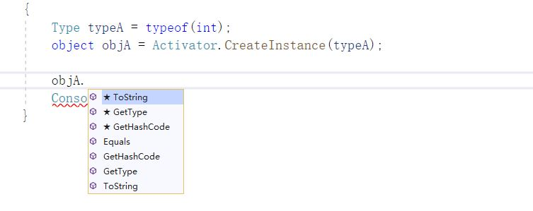
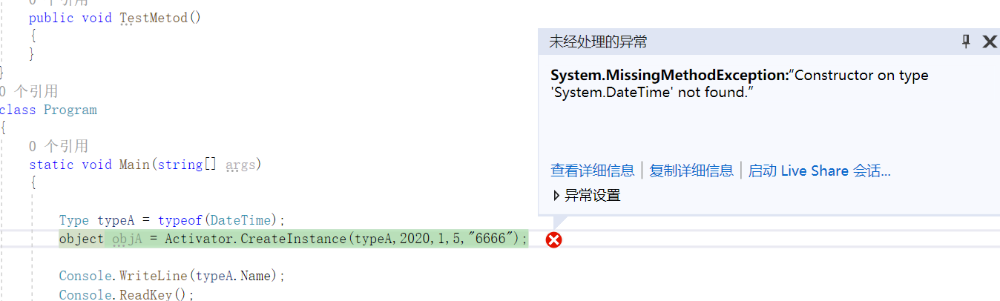

# C#反射与特性(四)：实例化类型


前面三篇文章，介绍了使用程序集、获取 Type 类型、使用 Type 类型获取成员信息。

通过前面的学习，我们大概了解到 Assembly、PropertyInfo、FieldInfo、ConstructorInfo、MethodInfo、ParameterInfo、EventInfo、MemberInfo 的存在和输出信息。

从本篇文章，将开始通过反射实例化类型，进行一系列的反射操作实践。

本篇文章，主要讲述实例化类型、实例化委托。


## 1，实例化类型

从类型(Type)创建实例对象的方式，有两种

- Activator.CreateInstance() 方法 ，通过 类型 Type
- ConstructorInfo.Invoke()，通过 构造函数 ConstructorInfo


实例化一个类型时，首先考虑如何处置该类型的构造函数。


### 1.1 Activator.CreateInstance() 

首先，在 Microsoft Docs 中，这么定义：

使用与指定参数匹配程度最高的构造函数创建指定类型的实例。

这是什么意思呢？

我们来看一下 `Activator.CreateInstance()` 最常用的两个个重载。

```csharp
object? CreateInstance(Type type);
object? CreateInstance(Type type, params object[] args);
```

args 就是实例化类型时，给构造函数传递的参数。因为使用的是 object ，最终实例化是使用到的 构造函数 是 **区配程度** 最高的。


好了，不扯了，我们来实践一下。


#### 1.1.1 简单类型

```csharp
            Type typeA = typeof(int);
            object objA = Activator.CreateInstance(typeA);
```

通过上面的代码，我们可以很方便的实例化一个简单类型。

当然，你可以看到，创建后的类型是 object 。

那么，问题来了




反射后，少不得一顿装箱拆箱了。

目前来说，我们使用不了 int 的方法了，只能使用 object 。怎么办？

先留着后面再解决呗。


当然，可以直接使用 int ，那我还使用反射干嘛？

```csharp
int i = 666;
```

这样不就行了？


如果需要在程序生成后，引用 dll 的代码，我们可以这样做

```csharp
            Assembly ass = Assembly.LoadFrom(@"C:\Program Files\dotnet\packs\Microsoft.NETCore.App.Ref\3.0.0\ref\netcoreapp3.0\System.Runtime.dll");
            Type typeA = ass.GetType("System.Int32");
            object objA = Activator.CreateInstance(typeA);
```


#### 1.1.2 简单类型的构造函数

对于 int 这些简单类型，没有别的操作，直接实例化就行，这里例举 DateTime 类型，通过不同的参数，调用构造函数去实例化。

```csharp
            Type typeA = typeof(DateTime);
            object objA = Activator.CreateInstance(typeA,2020,1,5);
```


当然，如果无法找到合适的构造函数来实例化类型，则会弹出 `System.MissingMethodException` 异常。




#### 1.1.3 object

让我们创建一个类型

```csharp
        public MyClass(object a, object b)
        {

        }

        public MyClass(string a, string b)
        {

        }
        public MyClass(string a, object b)
        {

        }
```

通过反射创建实例

```
            Type typeA = typeof(MyClass);
            object objA = Activator.CreateInstance(typeA, 2020,666);

            Console.WriteLine(typeA.Name);
```

以上代码并不会报错。

原因有两个，① 类型转换至 object，会携带原类型的信息；② Activator.CreateInstance() 会寻找最优的构造函数。

所以上面创建实例化时，会调用 `public MyClass(int a, int b)`。没有符合的怎么办？那就调用最优解；

所以上面这点小意思，不会造成任何影响的。


对于简单类型，寻找过程如下

1，寻找相应类型的构造函数

`Activator.CreateInstance(typeA, 2020,666)`，2020 是 typeo(int)，666 是 typeof(int)。

最优是 ` public MyClass(int a, int b)`

2，找不到的话，就找可以隐式转换的构造函数

例如 int -> long；

` public MyClass(long a, long b)`

3，如果没有隐式转换，则 object

`public MyClass(object a, object b)`


如果都没有符合条件的话，只能报错了；


验证一下

```csharp
    public class MyClass
    {
        public MyClass(string a, string b) { }
        public MyClass(int a, int b) { }
    }
    class Program
    {
        static void Main(string[] args)
        {
            Type typeA = typeof(MyClass);
            long a = 666;
            long b = 666;

            object objA = Activator.CreateInstance(typeA, a, b);

            Console.WriteLine(typeA.Name);
            Console.ReadKey();
        }
    }
```

不出意外的话，上面代码会报错。


#### 1.1.4 故意出错

```csharp
    public class MyClass
    {
        public MyClass(string a = null) { }
        public MyClass(StringBuilder a = null) { }
    }
    class Program
    {
        static void Main(string[] args)
        {
            Type typeA = typeof(MyClass);

            object objA = Activator.CreateInstance(typeA, null);

            Console.WriteLine(typeA.Name);
            Console.ReadKey();
            Console.ReadKey();
        }
    }
```

如无意外，上面的代码，执行后会报错。

因为当实例化时，参数为 null，有两个符合要求的构造函数。

其它情况下，根据 1.1.3 中，寻找构造函数的步骤，可以大致判断是否会出错。


#### 1.1.5 Activator.CreateInstance() 性能

我们来通过正常的代码实例化一个类型，实声明并且赋值，共 1 千万次。

```csharp
            Stopwatch time = new Stopwatch();
            time.Start();
            for (int i = 0; i < 1_000_0000; i++)
            {
                int a = 666;
            }
            time.Stop();
            Console.WriteLine(time.ElapsedMilliseconds);
            time.Reset();
            time.Restart();
            for (int i = 0; i < 1_000_0000; i++)
            {
                int a = 666;
            }
            time.Stop();
            Console.WriteLine(time.ElapsedMilliseconds);
```

时间

```
24
23
```


使用反射

```csharp
            Type typeA = typeof(int);
            Stopwatch time = new Stopwatch();
            time.Start();

            for (int i = 0; i < 1_000_0000; i++)
            {
                object objA = Activator.CreateInstance(typeA);
            }
            time.Stop();
            Console.WriteLine(time.ElapsedMilliseconds);
            time.Reset();
            time.Restart();
            for (int i = 0; i < 1_000_0000; i++)
            {
                object objA = Activator.CreateInstance(typeA);
            }
            time.Stop();
            Console.WriteLine(time.ElapsedMilliseconds);
```

时间

```
589
504
```


500 / 25 = 20，没错，性能相差了 20倍以上。


### 1.2 ConstructorInfo.Invoke()

`ConstructorInfo.Invoke()` 调用构造函数的限制性比`Activator.CreateInstance() ` 高，并且是严格对应的。

1.1.4 中，故意出错的代码中，可以看到因为 null 时，有多个构造函数符合条件而导致程序报错。


使用 `ConstructorInfo.Invoke()` 创建实例进行测试。

```csharp
    public class MyClass
    {
        public MyClass(string a = null) { Console.WriteLine(6666); }
        public MyClass(StringBuilder a = null) { }
    }
    class Program
    {
        static void Main(string[] args)
        {
            // 通过唯一性获取构造函数
            // 通过参数类型和数量，获取到唯一的构造函数
            ConstructorInfo conStruct = typeof(MyClass).GetConstructor(new Type[] { typeof(string) });

            // 传输参数值并且进行实例化
            object objA = conStruct.Invoke(new object[] { null });

            Console.ReadKey();
        }
    }
```


使用 `typeof(MyClass).GetConstructor(new Type[] { typeof(string) });` 获取到类型的构造函数，然后使用 `ConstructorInfo.Invoke()` 实例化。


上面 `GetConstructor()` 的方法，重载定义如下

```csharp
public ConstructorInfo? GetConstructor(Type[] types);
```


通过什么的方法，可以使用 public 构造函数实例化一个类型，如果想调用非 public 的构造函数呢？

可以使用 `BindingFlags`，这些后面再慢慢学习。


## 2，实例化委托

使用 `Delegate.CreateDelegate()` 方法实例化一个委托，使用 `Delegate.DynamicInvoke()` 调用委托并且传递参数。

使用形式

```csharp
CreateDelegate(Type, Object, MethodInfo)
```

Type 是此委托类型，Object 、MethodInfo 是实例类型、方法。

有两种情况，一种是实例方法、一种是静态方法。


我们创建一个委托以及类型

```csharp
    delegate int Test(int a, int b);
    public class MyClass
    {
        public  int A(int a, int b)
        {
            Console.WriteLine("A");
            return a + b;
        }
        public static int B(int a, int b)
        {
            Console.WriteLine("B");
            return a - b;
        }
    }
```

Main() 中 实验代码如下

```csharp
            // 绑定实例方法
            Delegate d1 = Delegate.CreateDelegate(typeof(Test), new MyClass(), "A");

            // 绑定静态方法
            Delegate d2 = Delegate.CreateDelegate(typeof(Test), typeof(MyClass), "B");

            Console.WriteLine(d1.DynamicInvoke(333,333));
            Console.WriteLine(d2.DynamicInvoke(999,333));

            Console.ReadKey();
```

输出

```
A
666
B
666
```


## 3，实例化泛型类型

### 3.1 实例化泛型

实例化一个泛型类型时，可以按照实例化普通类型过程操作

```csharp
            // 正常
            Type type = typeof(List<int>);
            object obj = Activator.CreateInstance(type);

            // 下面的会报错
            Type _type = typeof(List<>);
            object _obj = Activator.CreateInstance(_type);
```


使用 `Activator.CreateInstance` 方法实例化一个泛型类型时，必须是 `已绑定类型参数` 的泛型 Type。

`List<int>` 已绑定 √； `List<>` 未绑定 ×。


另外，通过 `ConstructorInfo.Invoke()` 实例化也是一样的。

```csharp
    public class MyClass<T>
    {
        public MyClass(T a)
        {
            Console.WriteLine(a);
        }
    }
    class Program
    {
        static void Main(string[] args)
        {
            // 正常
            ConstructorInfo type = typeof(MyClass<int>).GetConstructor(new Type[] { typeof(int) });
            object obj = type.Invoke(new object[] { 666 });

            Console.ReadKey();
        }
    }
```


### 3.2 构造封闭泛型类型以及反转

#### 3.2.1 构造封闭构造函数

有时候，传递过来的恰恰是 `List<>` 呢？

使用 `Type.MakeGenericType(Type)`，

我们可以这样多一步，将未绑定类型参数的泛型 Type，转为封闭的 泛型 Type。

```csharp
            Type type = typeof(List<>);

            // 构建泛型 Type
            Type _type = type.MakeGenericType(typeof(int));
            object _obj = Activator.CreateInstance(_type);
```


#### 3.2.2 去除泛型类型的参数类型绑定

使用 `Type.GetGenericTypeDefinition()` 方法可以去除一个**已绑定参数类型的泛型类型**的参数类型。

```csharp
            Type type = typeof(List<int>);
            Console.WriteLine(type.FullName);
            // 构建泛型 Type
            Type _type = type.GetGenericTypeDefinition();
            Console.WriteLine(_type.FullName);
```

输出

```
System.Collections.Generic.List`1[[System.Int32, System.Private.CoreLib, Version=4.0.0.0, Culture=neutral, PublicKeyToken=7cec85d7bea7798e]]
System.Collections.Generic.List`1
```

`List<int>` 变成了 `List<>`。


#### 3.2.3 实践一下

上面介绍了泛型类型的实例化和两个关于参数类型的使用，下面来实践一下

```csharp
        static void Main(string[] args)
        {
            Type typeA = typeof(Console);
            Type typeB = typeof(List<>);
            Type typeC = typeof(List<int>);

            去除泛型类型绑定的参数类型(typeA);
            去除泛型类型绑定的参数类型(typeB);
            去除泛型类型绑定的参数类型(typeC);
            Console.ReadKey();
        }

        /// <summary>
        ///  将 List<T> 转为 List<>
        /// </summary>
        /// <param name="type"></param>
        /// <returns></returns>
        public static (bool, Type) 去除泛型类型绑定的参数类型(Type type)
        {
            // 检查是否泛型类型
            if (type.IsGenericType == false)
            {
                Console.WriteLine("此类型不是泛型类型");
                return (false, type);
            }

            // 检查是否是未绑定参数类型的泛型类型
            if (type.IsGenericTypeDefinition)
            {
                Console.WriteLine("本来就不需要处理");
                return (true, type);
            }

            Type _type = type.GetGenericTypeDefinition();
            Console.WriteLine("处理完毕");
            return (true, _type);
        }
    }
```
