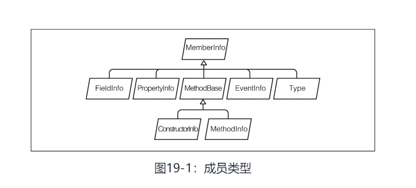
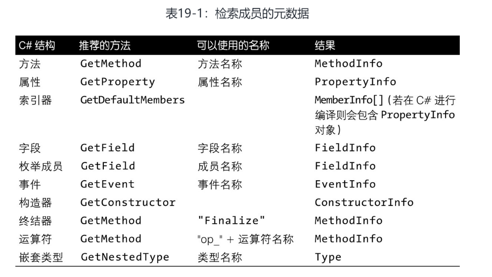

# C#反射与特性(五)：类型成员操作

前面三篇中，介绍了反射的基本内容和信息对象，反射主要作用于构造函数、属性、字段、方法、事件等类型成员对象；第四篇介绍了类型的实例化和事件操作。

本篇介绍类型的成员操作和实践练习。由于内容较多，多动手实践一下。



<center>[图片1 来源：《C# 7.0核心技术指南：19.2 反射并调用成员》]</center>

那么，如何通过 Type 获取相应的成员呢？



<center>[图片2 来源：《C# 7.0核心技术指南：19.2 反射并调用成员》]</center>

以上方法具有获取单个成员或多个成员的版本。

所有的 *Info 实例都会在第一次使用时，由反射 API 缓存起来，这种缓存有助于优化 API 的性能。


## 1，MemberInfo

MemberInfo 可以获取有关成员属性的信息，并提供对成员元数据的访问权限。

MemberInfo 类是用于获取有关类的所有成员（构造函数、事件、字段、方法和属性）的信息的类的抽象基类。

由图片1可以看到，MemberInfo 是所有反射类型的基类，此类为所有成员提供了基本功能。


使用 `GetMember()` 或 `GetMembers()` 可以获取类型的一个或多个成员。

`GetMembers()`该方法会返回当前类型（及其基类）的所有**公有成员**。

`GetMember` 方法可以通过名称检索特定的成员。由于成员（方法、属性等）可能会被重载，因此该方法会返回一个数组。

例如

```csharp
            MemberInfo[] members = type.GetMember("test");
```


### 1.1 练习-获取类型的成员以及输出信息

创建一个类型

```csharp
    public class MyClass
    {
        private static string A { get; set; }
        public string B;
        public string C { get; set; }

        [Required] 
        public int Id { get; set; }
        
        [Phone] 
        public string Phone { get; set; }

        [EmailAddress]
        public string Email { get; set; }

        static MyClass()
        {
            A = "666";
        }

        public MyClass()
        {
            B = "666";
        }

        public MyClass(string message)
        {
            C = message;
        }

        public string Add(string a, string b)
        {
            return a + b;
        }
    }
```


打印

```csharp
            Type type = typeof(MyClass);
            MemberInfo[] members = type.GetMembers();
            foreach (var item in members)
            {
                Console.WriteLine(item.Name + "    |     " + item.MemberType);
            }

```

输出

```csharp
get_C    |     Method
set_C    |     Method
get_Id    |     Method
set_Id    |     Method
get_Phone    |     Method
set_Phone    |     Method
get_Email    |     Method
set_Email    |     Method
Add    |     Method
GetType    |     Method
ToString    |     Method
Equals    |     Method
GetHashCode    |     Method
.ctor    |     Constructor
.ctor    |     Constructor
C    |     Property
Id    |     Property
Phone    |     Property
Email    |     Property
B    |     Field
```


### 1.2 MemberType 枚举

`MemberInfo` 中有个 MemberType 枚举的属性 名为 MemberType 。

`MemberType` 枚举的定义如下

| 名称        | 值   | 说明                       |
| ----------- | ---- | -------------------------- |
| All         | 191  | 指定所有成员类型           |
| Constructor | 1    | 指定该成员是构造函数       |
| Custom      | 64   | 指定该成员是自定义成员类型 |
| Event       | 2    | 指定该成员是事件           |
| Field       | 4    | 指定该成员是字段           |
| Method      | 8    | 指定该成员是方法           |
| NestedType  | 128  | 指定该成员是嵌套类型       |
| Property    | 16   | 指定该成员是属性           |
| TypeInfo    | 32   | 指定该成员是类型           |

其中 `MemverType.All` 的定义如下 `All = NestedType | TypeInfo | Property | Method | Field | Event | Constructor`。


### 1.3 MemberInfo 获取成员方法并且调用

下面的例子是通过 GetMembers 获取到 方法成员，并且传递参数调用。

这里只是示例一下，关于方法的实例化和调用，在本文的第三节。

```csharp
            MemberInfo[] members = type.GetMembers();
            foreach (var item in members)
            {
                // 如果成员属于方法
                if (item.MemberType == MemberTypes.Method)
                {
                    // 输出此方法的参数列表：参数类型+参数名称
                    foreach (ParameterInfo pi in ((MethodInfo)item).GetParameters())
                    {
                        Console.WriteLine("Parameter: Type={0}, Name={1}", pi.ParameterType, pi.Name);
                    }
                    // 如果是方法有两个参数，则调用
                    if (((MethodInfo)item).GetParameters().Length == 2)
                    {
                        // 调用一个方法以及传递参数
                        MethodInfo method = (MethodInfo)item;
                        Console.WriteLine("调用一个方法，输出结果：");
                        Console.WriteLine(method.Invoke(example, new object[] { "1", "2" }));
                    }
                }
            }

```


### 1.4 获取继承中方法的信息(DeclaringType 和 ReflectedType)

MemberInfo 中，有三种获取类型的属性：

- MemberType 获取成员何种函数(例如字段、属性、方法等)；
- DeclaringType 该属性返回该成员的定义类型；
- ReflectedType 返回调用 GetMembers 的具体类型；


因为一个方法可以继承，也可以重写，那么很多时候判断和调用，就需要了解相关信息；

DeclaringType ：一个类型中使用了父类或者自己的方法，那么返回此方法的出处；

ReflectedType ：从哪个类型中获取，就返回哪个类型；即从个 Type 里获得成员实例，就返回这个 Type 的名称；


新建一个两个类型

```csharp
    /// <summary>
    /// 父类
    /// </summary>
    public class MyClassFather
    {
        /// <summary>
        /// 重写 ToString()
        /// </summary>
        /// <returns></returns>
        public override string ToString()
        {
            return base.ToString();
        }
    }

    /// <summary>
    /// 子类
    /// </summary>
    public class MyClassSon : MyClassFather
    {
    }
```

控制台 Program.Main 中，编写

```csharp
            Type typeFather = typeof(MyClassFather);
            Type typeSon = typeof(MyClassSon);
            Type typeObj = typeof(object);
            Type typeProgram = typeof(Program);

            // 为了省步骤，就不用 MemberInfo 了
            MethodInfo methodObj = typeObj.GetMethod("ToString");
            MethodInfo methodFather = typeFather.GetMethod("ToString");
            MethodInfo methodSon = typeSon.GetMethod("ToString");
            MethodInfo methodProgram = typeProgram.GetMethod("ToString");

```

打印 `DeclaringType `

```csharp
            Console.WriteLine(methodObj.DeclaringType);
            Console.WriteLine(methodFather.DeclaringType);
            Console.WriteLine(methodSon.DeclaringType);
            Console.WriteLine(methodProgram.DeclaringType);
```

输出

```csharp
System.Object
Mytest.MyClassFather
Mytest.MyClassFather
System.Object
```

解析：

MyClassFather 对 `ToString` 方法进行了重写，所以 `DeclaringType` 获取到的类型就是 MyClassFather ;

MyClassSon 继承了 MyClassFather，直接使用父类的 `ToString()` 方法，所以返回的是 MyClassFather ；

Program 没有对 `ToString()` 进行重写，所以返回的是 Object；

 


## 2，从 IL 看反射

笔者的 IL 知识非常薄弱，只能列出一些简单的内容。

在最前面的练习中，我们发现

```csharp
        public string C { get; set; }
```

输出了

```
get_C    |     Method
set_C    |     Method
C    |     Property
```

生成的 IL 是这样的

```csharp
.property instance string C()
{  
    .get instance string Mytest.MyClass::get_C()  
    .set instance void Mytest.MyClass::set_C(string)
} 
```

属性、索引器、事件生成的 IL 总结：


上面三种类型，生成 IL 时，都会有相应的 方法生成，通过 `GetMethods()` 或者 `GetMembers()` 可以获取到。


### 2.1 获取属性的构造

定义一个类型

```csharp
    public class MyClass
    {
        private string Test;

        public string A
        {
            get { return Test; }
        }

        public string B
        {
            set { Test = value; }
        }

        public string C { get; set; }
    }
```

从前面的实例中，有不少是获取属性列表的示例，但是无法从中识别出里面的构造，例如上面的 MyClass 类型。

`PropertyInfo` 中有个 `GetAccessors()` 方法，可以获取相应的信息。

| 方法                  | 使用说明                                                     |
| --------------------- | ------------------------------------------------------------ |
| GetAccessors()        | 返回一个数组，其元素反射了由当前实例反射的属性的公共 `get` 和 `set` 访问器。 |
| GetAccessors(Boolean) | 返回一个数组，其元素反射了当前实例反射的属性的公共及非公共（如果指定）`get` 和 `set` 取值函数。 |

使用示例

```csharp
            Type type = typeof(MyClass);
            PropertyInfo[] list = type.GetProperties();
            foreach (var item in list)
            {
                var c = item.GetAccessors();
                foreach (var node in c)
                {
                    Console.WriteLine(node);
                }

                Console.WriteLine("************");
            }
```

输出

```csharp
System.String get_A()
************
Void set_B(System.String)
************
System.String get_C()
Void set_C(System.String)
************
```


如果将上面的属性 C 改成

```csharp
        public string C { get; private set; }
```

那么只能输出

```
System.String get_A()
************
Void set_B(System.String)
************
System.String get_C()
************
```

如果想获取私有构造器，可以使用`.GetAccessors(true)`。

### 2.2 属性的方法

从反射和 IL 我们得知，一个属性会自动生成两个方法。

那么我们通过 PropertyInfo 可以获取到这些方法。

| 方法         | 使用说明                                  |
| ------------ | ----------------------------------------- |
| GetSetMethod | 获取 set 方法，返回 MethodInfo            |
| GetGetMethod | 获取 get 方法，返回 MethodInfo            |
| GetAccessors | 获取上面两个方法的集合，返回 MethodInfo[] |

创建一个属性

```csharp
        public string C { get;  set; }
```

```csharp
            Type type = typeof(MyClass);
            PropertyInfo property = type.GetProperty("C");
            // 指定获取 get 或 set
            MethodInfo set = property.GetSetMethod();
            MethodInfo get = property.GetGetMethod();

            MethodInfo[] all = property.GetAccessors();
```


## 3，方法操作

我们要记得，反射，是对元数据的利用；只有实例才能被执行调用。

在这里，说一下 `nameof` 关键字，nameof 没有任何作用，他不会对程序产生任何影响。

nameof(T) 可以输出 T，例如 `namaof(Program)` 输出 `Program`。

那么什么情况下使用到他呢？

我们在写代码时，会使用到例如  Visual Studio 等 IDE，如果使用 nameof，里面的类型是强类型的，可以查找引用、跳转、获取注释等。如果需要重构，也可以快速重命名所有引用。

如果直接使用字符串的话，容易拼错命名、一旦修改一个命名，需要手动找到所有字符串进行修改。


调用一个实例方法有如下步骤：

| 步骤         | 类型                    | 说明                                            |
| ------------ | ----------------------- | ----------------------------------------------- |
| 获取 Type    | Type                    | 通过程序集等各种方式获取 Type 类型              |
| 获取实例     | object                  | 通过 `Activator.CreateInstance(type);` 创建实例 |
| 获取方法     | MethodInfo或 MemberInfo | 通过 Type 获取对应的方法                        |
| 设置参数列表 | object[] parameters     | 调用方法时传递的参数                            |
| 执行方法     | .Invoke() 方法          | 执行 MethodInfo.Invoke()                        |
| 获取返回结果 | object                  | 执行方法获取到返回结果                          |


### 3.1 各种方式调用方法

首先我们定义一个类型

```csharp
    public class MyClass
    {
        /// <summary>
        /// 无参数，五返回值
        /// </summary>
        public void A()
        {
            Console.WriteLine("A被执行");
        }

        /// <summary>
        /// 有参数，有返回值
        /// </summary>
        /// <param name="a"></param>
        /// <returns></returns>
        public string B(string left)
        {
            Console.WriteLine("执行 B(string left)");
            return left + "666";
        }

        public string C(string left,int right)
        {
            Console.WriteLine("执行 C(string left,int right)");
            return left + right;
        }

        public string C(string left, string right)
        {
            Console.WriteLine("执行 C(string left, string right)");
            return left + right;
        }
    }
```

在 Program 编写代码获取到类型的 Type 以及创建实例。

```csharp
            Type type = typeof(MyClass);

            object example = Activator.CreateInstance(type);
```

#### 3.1.1 调用方法

我们来调用方法 `A()`

```csharp
            // 获取 A
            MethodInfo methodA = type.GetMethod(nameof(MyClass.A));
            
            // 传递实例，并且执行实例的 A 方法
            methodA.Invoke(example, new Object[] { });
```


方法 `B` 有一个参数，我们调用时添加参数进去

```csharp
            object result;

            // 获取 B
            MethodInfo methodB = type.GetMethod(nameof(MyClass.B));

            // 传递参数
            // 执行获取返回结果
            result = methodB.Invoke(example, new[] {"测试"});
```

#### 3.1.2 获取参数列表

前面 1.1 中，示例有关于获取方法参数的代码。这里不再赘述


#### 3.1.3 获取重载方法

在 《C# 反射与特性》系列的第四篇，我们介绍了构造函数 ConstructorInfo 的调用和重载，MethodInfo 实际上也是差不多的。

上面我们使用了 `type.GetMethod("方法名称")` 的方法获取了 MethodInfo ，对于 `MyClass.C`，有两个重载，那么我们可以这样指定要使用的重载方法

```csharp
            // 获取 C
            // 执行获取返回结果
            MethodInfo methodC = type.GetMethod(nameof(MyClass.C), new Type[] {typeof(string), typeof(string)});
            result = methodC.Invoke(example, new string[] {"测试", "测试"});
            //       result = methodC.Invoke(example, new Object[] {"测试", "测试"});
```
