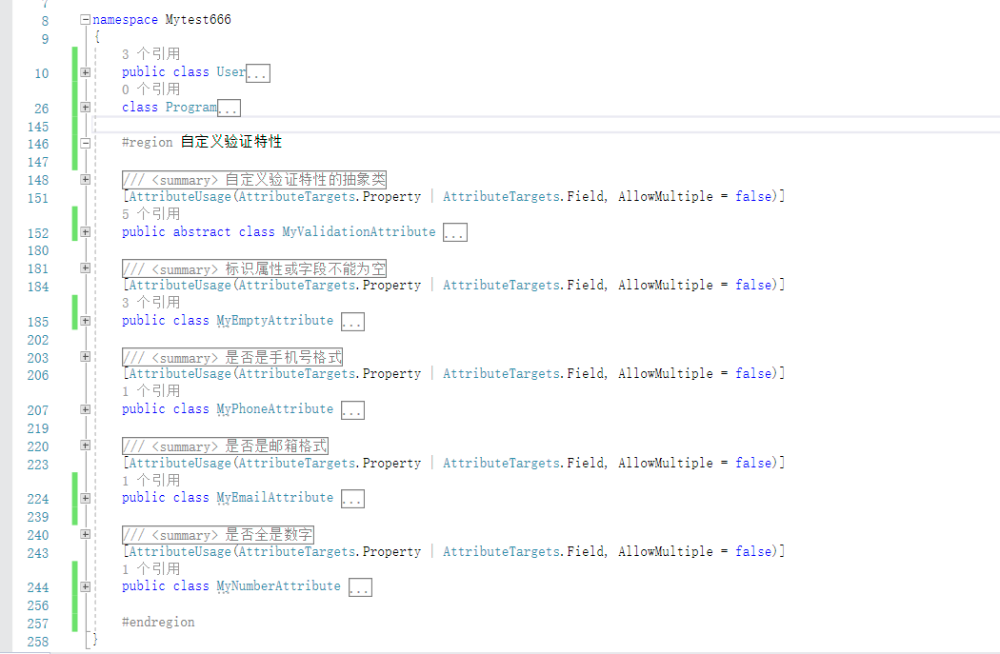

# 7. 自定义特性及其应用

本章的内容，主要是对**属性和字段进行赋值和读值**、自定义特性、将特性应用到实际场景。

本文内容已经上传到 \[[https://gitee.com/whuanle/reflection\_and\_properties/blob/master/C%23反射与特性\(7\)自定义特性以及应用.cs\]\(https://gitee.com/whuanle/reflection\_and\_properties/blob/master/C%23反射与特性\(7\)自定义特性以及应用.cs](https://gitee.com/whuanle/reflection_and_properties/blob/master/C%23反射与特性%287%29自定义特性以及应用.cs]%28https://gitee.com/whuanle/reflection_and_properties/blob/master/C%23反射与特性%287%29自定义特性以及应用.cs)\)

## 1，属性字段的赋值和读值

第五篇中，介绍了成员方法的重载已经调用方式，第六篇中，对以往知识进行了总结以及实践练习，这一节将介绍对属性和字段的操作。

从前面我们知道，通过反射可以获取到属性 PropertyInfo 、字段 FieldInfo，在《[C\#反射与特性\(三\)：反射类型的成员](https://www.cnblogs.com/whuanle/p/12152660.html)》的 1.2 获取属性、字段成员中，有详细介绍。这里不再详细赘述，下面正式进入话题。

PropertyInfo 中的 `GetValue()`和 `SetValue()` 可以获得或者设置 实例属性和字段的值。

创建一个类型

```text
    public class MyClass
    {
        public string A { get; set; }
    }
```

编写测试代码

```text
            // 获取 Type 以及 PropertyInfo
            Type type = typeof(MyClass);
            PropertyInfo property = type.GetProperty(nameof(MyClass.A));

            // 实例化 MyClass
            object example1 = Activator.CreateInstance(type);
            object example2 = Activator.CreateInstance(type);

            // 对实例 example 中的属性 A 进行赋值
            property.SetValue(example1,"赋值测试");
            property.SetValue(example2, "Natasha牛逼");


            // 读取实例中的属性值
            Console.WriteLine(property.GetValue(example1));
            Console.WriteLine(property.GetValue(example2));
```

这里要强调的是，反射中的类型调用操作（调用方法属性等），必须是通过**实例**来完成。

那些 Type 、PropertyInfo 都是对元数据的读取，只能读，只有实例才能对程序产生影响。

从上面的操作中，我们通过反射，创建两个 example 实例，然后再通过反射对实例进行操作，实现读值赋值。

属性的值操作非常简单，没有别的内容要说明了。

## 2，自定义特性和特性查找

在 ASP.NET Core 中，对于 Controller 和 Action ，我们可以使用 `[HttpGet]`、`[HttpPost]`、`[HttpDelete]` 等特性，定义请求类型以及路由地址。

在 EFCore 中，我们可以使用 `[Key]`、`[Required]` 等特性，其它框架也有各种各样的特性。

特性可以用来修饰类、属性、接口、结构、枚举、委托、事件、方法、构造函数、字段、参数、返回值、程序集、类型参数和模块等。

### 2.1 特性规范和自定义特性

C\# 中，预定义了三种特性类型：

| 名称 | 类型 | 说明 |
| :--- | :--- | :--- |
| Conditional | 位映射特性 | 可以映射到类型元数据的特定位上，public、abstract 以及 sealed 都会编译为位映射特性 |
| AttributeUsage | 自定义特性 | 自定义的特性 |
| Obsolete | 伪自定义特性 | 与自定义特性类似，但伪自定义特性会被编译器或者CLR内部进行优化 |

位映射特性大多数只在空间中占据一位空间，非常高效。

特性是一个类，继承了 Attribute ，特性\(类\)的命名，必须以 `Attribute` 作为后缀。

#### 2.1.1 定义特性

首先创建一个类继承 `System.Attribute`

```text
    public class MyTestAttribute : Attribute
    {

    }
```

#### 2.1.2 限制特性的使用

通过 `AttributeUsageAttribute` 限定定义特性可以应用在哪种类型上。

使用示例

```text
    [AttributeUsage(AttributeTargets.Property | AttributeTargets.Field)]
    public class MyTestAttribute : Attribute
    {

    }
```

AttributeUsageAttribute 定义一个特性时，大概格式如下

```text
[AttributeUsage(
   validon,
   AllowMultiple=allowmultiple,
   Inherited=inherited
)]
```

validon 指 AttributeTargets 枚举，AttributeTargets 枚举类型如下

| 枚举 | 值 | 说明 |
| :--- | :--- | :--- |
| All | 32767 | 可以对任何应用程序元素应用属性 |
| Assembly | 1 | 可以对程序集应用属性 |
| Class | 4 | 可以对类应用属性 |
| Constructor | 32 | 可以对构造函数应用属性 |
| Delegate | 4096 | 可以对委托应用属性 |
| Enum | 16 | 可以对枚举应用属性 |
| Event | 512 | 可以对事件应用属性 |
| Field | 256 | 可以对字段应用属性 |
| GenericParameter | 16384 | 可以对泛型参数应用属性。 目前，此属性仅可应用于 C\#、Microsoft 中间语言 \(MSIL\) 和已发出的代码中 |
| Interface | 1024 | 可以对接口应用属性 |
| Method | 64 | 可以对方法应用属性 |
| Module | 2 | 可以对模块应用属性。 `Module` 引用的是可移植可执行文件（.dll 或 .exe），而不是 Visual Basic 标准模块 |
| Parameter | 2048 | 可以对参数应用属性 |
| Property | 128 | 可以对属性 \(Property\) 应用属性 \(Attribute\) |
| ReturnValue | 8192 | 可以对返回值应用属性 |
| Struct | 8 | 可以对结构应用属性，即值类型 |

AllowMultiple 标识是否允许在同一个地方多次使用此特性，默认不允许。如果设置为 true，则可以在同一个属性或字段等，多次使用此特性。

Inherited 指派生类继承一个使用此特性的类型时，是否允许派生类继承此特性。例如 A 使用了此特性，B 继承于 A，如果 `Inherited = true`，则派生类也会拥有此特性。

#### 2.1.3 特性的构造函数和属性

特性可以拥有构造函数和属性字段等，这些信息通过使用特性时配置。

定义一个特性

```text
    [AttributeUsage(AttributeTargets.Class | AttributeTargets.Property | AttributeTargets.Field)]
    public class MyTestAttribute : Attribute
    {
        private string A;
        public string Name { get; set; }
        public MyTestAttribute(string message)
        {
            A = message;
        }
    }
```

使用

```text
    public class MyClass
    {
        [MyTest("test", Name = "666")]
        public string A { get; set; }
    }
```

### 2.2 检索特性

前面创建了自定义特性，然后就到了查找/检索特性的环节。

但是这些步骤有什么用处呢？作用于什么场景呢？这里先不用管，按照步骤做一次先。

检索特性的方式有两种

* 调用 Type 或者 MemberInfo 的 GetCustomAttributes 方法;
* 调用 Attribute.GetCustomAttribute 或者 Attribute.GetCustomAttributes 方法；

#### 2.2.1 方式一

先定义特性

```text
    [AttributeUsage(AttributeTargets.Class | AttributeTargets.Property | AttributeTargets.Field)]
    public class ATestAttribute : Attribute
    {
        public string NameA { get; set; }
    }

    [AttributeUsage(AttributeTargets.Class | AttributeTargets.Property | AttributeTargets.Field)]
    public class BTestAttribute : Attribute
    {
        public string NameB { get; set; }
    }
```

使用特性

```text
    [ATest(NameA = "Myclass")]
    public class MyClass
    {
        [Required]
        [EmailAddress]
        [ATest(NameA = "A")]
        public string A { get; set; }

        [Required]
        [EmailAddress]
        [ATest(NameA = "B")]
        [BTest(NameB = "BB")]
        public string B { get; set; }
    }
```

运行时检索

```text
            Type type = typeof(MyClass);
            MemberInfo[] member = type.GetMembers();

            // Type 或者 MemberInfo 的 GetCustomAttributes 方法


            // Type.GetCustomAttributes() 获取类型的特性
            IEnumerable<Attribute> attrs = type.GetCustomAttributes();

            Console.WriteLine(type.Name + "具有的特性：");
            foreach (ATestAttribute item in attrs)
            {
                Console.WriteLine(item.NameA);
            }

            Console.WriteLine("**********");

            // 循环每个成员
            foreach (MemberInfo item in member)
            {
                // 获取每个成员拥有的特性
                var attrList = item.GetCustomAttributes();
                foreach (Attribute itemNode in attrList)
                {
                    // 如果是特性 ATestAttribute
                    if (itemNode.GetType() == typeof(ATestAttribute))
                        Console.WriteLine(((ATestAttribute)itemNode).NameA);

                    else if (itemNode.GetType() == typeof(BTestAttribute))
                        Console.WriteLine(((BTestAttribute)itemNode).NameB);

                    else
                        Console.WriteLine("这不是我定义的特性：" + itemNode.GetType());
                }
            }
```

#### 2.2.2 方式二

上面的自定义特性和 MyClass 类不作改变，将 Main 方法的代码改成如下

```text
            Type type = typeof(MyClass);

            // Attribute[] classAttr = Attribute.GetCustomAttributes(type);
            // 获取类型的指定特性
            Attribute classAttr = Attribute.GetCustomAttribute(type,typeof(ATestAttribute));
            Console.WriteLine(((ATestAttribute)classAttr).NameA);
```

## 3，设计一个数据验证工具

为了学以致用，这里实现一个数据验证功能，能否检查类型中的属性是否符合要求。

要求实现：

* 能够检查对象的属性是否符合格式要求；
* 自定义验证失败消息；
* 动态实现
* 良好的编程风格和可拓展性

代码完成后大约这个样子（250行左右）：



### 3.1 定义抽象验证特性类

首先定义一个抽象特性类，作为我们自定义验证的基础类，方便后面实现拓展。

```text
    /// <summary>
    /// 自定义验证特性的抽象类
    /// </summary>
    [AttributeUsage(AttributeTargets.Property | AttributeTargets.Field, AllowMultiple = false)]
    public abstract class MyValidationAttribute : Attribute
    {
        private string Message;
        /// <summary>
        /// 验证不通过时，提示信息
        /// </summary>
        public string ErrorMessage
        {
            get
            {
                return string.IsNullOrEmpty(Message) ? "默认报错" : Message;
            }
            set
            {
                Message = value;
            }
        }

        /// <summary>
        /// 检查验证是否通过
        /// </summary>
        /// <param name="value"></param>
        /// <returns></returns>
        public virtual bool IsValid(object value)
        {
            return value == null ? false : true;
        }
    }
```

设计原理：

ErrorMessage 为自定义的验证失败提示消息；如果使用时不填写，默认为 `"默认报错"`。

IsValid 指示自定义验证特性类的验证入口，通过此方法可以检查属性是否通过了验证。

### 3.2 实现多个自定义验证特性

基于 MyValidationAttribute ，我们继承后，开始实现不同类型的数据验证。

这里实现了四个验证：非空验证、手机号验证、邮箱格式验证、是否为数字验证。

```text
    /// <summary>
    /// 标识属性或字段不能为空
    /// </summary>
    [AttributeUsage(AttributeTargets.Property | AttributeTargets.Field, AllowMultiple = false)]
    public class MyEmptyAttribute : MyValidationAttribute
    {
        /// <summary>
        /// 验证是否为空
        /// </summary>
        /// <param name="value"></param>
        /// <returns></returns>
        public override bool IsValid(object value)
        {
            if (value == null)
                return false;

            if (string.IsNullOrEmpty(value.ToString()))
                return false;
            return true;
        }
    }

    /// <summary>
    /// 是否是手机号格式
    /// </summary>
    [AttributeUsage(AttributeTargets.Property | AttributeTargets.Field, AllowMultiple = false)]
    public class MyPhoneAttribute : MyValidationAttribute
    {
        public override bool IsValid(object value)
        {
            if (value == null)
                return false;

            if (string.IsNullOrEmpty(value.ToString()))
                return false;

            string pattern = "^((13[0-9])|(14[5,7])|(15[0-3,5-9])|(17[0,3,5-8])|(18[0-9])|166|198|199|(147))\\d{8}$";
            Regex regex = new Regex(pattern);
            return regex.IsMatch(value.ToString());
        }
    }

    /// <summary>
    /// 是否是邮箱格式
    /// </summary>
    [AttributeUsage(AttributeTargets.Property | AttributeTargets.Field, AllowMultiple = false)]
    public class MyEmailAttribute : MyValidationAttribute
    {
        public override bool IsValid(object value)
        {
            if (value == null)
                return false;

            if (string.IsNullOrEmpty(value.ToString()))
                return false;

            string pattern = @"^[A-Za-z0-9\u4e00-\u9fa5]+@[a-zA-Z0-9_-]+(\.[a-zA-Z0-9_-]+)+$";
            Regex regex = new Regex(pattern);
            return regex.IsMatch(value.ToString());
        }
    }

    /// <summary>
    /// 是否全是数字
    /// </summary>
    [AttributeUsage(AttributeTargets.Property | AttributeTargets.Field, AllowMultiple = false)]
    public class MyNumberAttribute : MyValidationAttribute
    {
        public override bool IsValid(object value)
        {
            if (value == null)
                return false;

            if (string.IsNullOrEmpty(value.ToString()))
                return false;

            string pattern = "^[0-9]*$";
            Regex regex = new Regex(pattern);
            return regex.IsMatch(value.ToString());
        }
    }
```

实现原理：

通过正则表达式去判断属性值是否符合格式（正则表达式都是我抄来的，笔者本人对正则表达式不熟）。

需要说明的是，上面的验证代码，还是需要改进的，要适应各种类型的验证。

### 3.3 检查特性是否属于自定义验证特性

检查一个特性是否属于我们自定义验证的特性。

如果不是的话，就不需要理会。

```text
        /// <summary>
        /// 检查特性是否属于 MyValidationAttribute 类型的特性
        /// </summary>
        /// <param name="attribute">要检查的特性</param>
        /// <returns></returns>
        private static bool IsMyValidationAttribute(Attribute attribute)
        {
            Type type = attribute.GetType();
            return type.BaseType == typeof(MyValidationAttribute);
        }
```

实现原理：

我们自定义的验证特性类，都继承了 MyValidationAttribute 类型，如果一个特性的父类不是 `MyValidationAttribute` ，那肯定不是我们实现的特性。

### 3.4 检查属性值是否符合自定义验证特性的要求

这里涉及到属性取值、方法调用等，我们通过实例对象、特性对象、属性对象三者去判断一个属性的值是否符合这个特性的要求。

```text
        /// <summary>
        /// 验证此属性是否通过验证，只能验证 继承了 MyValidationAttribute 的属性
        /// </summary>
        /// <param name="attr">属性带有的特性</param>
        /// <param name="property">要验证的属性</param>
        /// <param name="obj">实例对象</param>
        /// <returns></returns>
        private static (bool, string) StartValid(Attribute attr, PropertyInfo property, object obj)
        {
            // 指定获取实例对象的属性值
            object value = property.GetValue(obj);
            // 获取特性的 IsValid 方法
            MethodInfo attrMethod = attr.GetType().GetMethod("IsValid", new Type[] { typeof(object) });
            // 获取特性的 IsValid 属性
            PropertyInfo attrProperty = attr.GetType().GetProperty("ErrorMessage");

            // 开始检查，获取检查结果
            bool checkResult = (bool)attrMethod.Invoke(attr, new object[] { value });

            // 获取特性的 ErrorMessage 属性
            string errorMessage = (string)attrProperty.GetValue(attr);

            // 通过验证的话，就没有报错信息
            if (checkResult == true)
                return (true, null);

            // 验证不通过，返回预定义的信息
            return (false, errorMessage);
        }
```

设计原理：

* 首先要验证的属性的值；
* 调用这个特性的 `IsValid` 方法，检查值是否通过验证；
* 获取自定义的验证失败消息；
* 返回验证结果；

### 3.5 实现解析功能

我们要实现一个功能：

解析对象的所有属性，逐一对属性进行检索，使用到我们设计的自定义验证特性的属性，就执行检查，去获取验证结果。

```text
        /// <summary>
        /// 解析功能
        /// </summary>
        /// <param name="list"></param>
        private static void Analysis(List<object> list)
        {
            foreach (var item in list)
            {
                Console.WriteLine("\n\n检查对象属性是否通过检查");
                // 获取实例对象的类型
                Type type = item.GetType();
                // 获取类的属性列表
                PropertyInfo[] properties = type.GetProperties();

                // 对每个属性进行检查，是否符合要求
                foreach (PropertyInfo itemNode in properties)
                {
                    Console.WriteLine($"\n属性：{itemNode.Name}，值为 {itemNode.GetValue(item)}");
                    // 此属性的所有特性
                    IEnumerable<Attribute> attList = itemNode.GetCustomAttributes();
                    if (attList != null)
                    {
                        // 开始对属性进行特性验证
                        foreach (Attribute itemNodeNode in attList)
                        {
                            // 如果不是我们自定义的验证特性，则跳过
                            if (!IsMyValidationAttribute(itemNodeNode))
                                continue;
                            var result = StartValid(itemNodeNode, itemNode, item);

                            // 验证跳过，提示消息
                            if (result.Item1)
                            {
                                Console.WriteLine($"通过了 {itemNodeNode.GetType().Name} 验证");
                            }
                            // 没通过验证的话
                            else
                            {
                                Console.WriteLine($"未通过了 {itemNodeNode.GetType().Name} 验证，报错信息： {result.Item2}");
                            }
                        }
                    }
                    Console.WriteLine("*****属性分割线******");
                }
                Console.WriteLine("########对象分割线########");
            }
        }
```

设计原理：

上面有三个循环，第一个是没什么意义；

因为我们的参数对象是一个对象列表，批量验证对象，所以需要逐个对象进行分析；

第二个循环，是逐个获取属性；

第三个循环是逐个获取属性的特性；

上面消息获取完毕，即可开始进行验证。

这里必须拿到三个参数：

* 实例化的对象：反射的基础是元数据，反射操作的基础是实例对象；
* 类型的属性 PropertyInfo ：要通过 PropertyInfo 获取到实例对象的属性值；
* 特性对象 Attribute：从实例对象中获取到的特性 Attribute 对象；

### 3.6 编写一个模型类

我们编写一个模型类型，来使用自定义的验证特性

```text
    public class User
    {
        [MyNumber(ErrorMessage = "Id必须全部为数字")]
        public int Id { get; set; }

        [MyEmpty(ErrorMessage = "用户名不能为空")]
        public string Name { get; set; }

        [MyEmpty]
        [MyPhone(ErrorMessage = "这不是手机号")]
        public long Phone { get; set; }

        [MyEmpty]
        [MyEmail]
        public string Email { get; set; }
    }
```

使用方法跟 EFCore 的差不多，非常简单。

你也可以多创建几个模型类进行测试。

### 3.7 执行验证

我们来实例化多个模型类并设置值，然后调用解析功能进行验证。

在 Main 功能加上以下代码：

```text
            List<object> users = new List<object>()
            {
                new User
                {
                    Id = 0
                },
                new User
                {
                    Id=1,
                    Name="痴者工良",
                    Phone=13510070650,
                    Email="666@qq.com"
                },
                new User
                {
                    Id=2,
                    Name="NCC牛逼",
                    Phone=6666666,
                    Email="NCC@NCC.NCC"
                }
            };

            Analysis(users);
```

如无意外，执行结果应该是这样的

```text
检查对象属性是否通过检查

属性：Id，值为 0
通过了 MyNumberAttribute 验证
*****属性分割线******

属性：Name，值为
未通过了 MyEmptyAttribute 验证，报错信息： 用户名不能为空
*****属性分割线******

属性：Phone，值为 0
通过了 MyEmptyAttribute 验证
未通过了 MyPhoneAttribute 验证，报错信息： 这不是手机号
*****属性分割线******

属性：Email，值为
未通过了 MyEmptyAttribute 验证，报错信息： 默认报错
未通过了 MyEmailAttribute 验证，报错信息： 默认报错
*****属性分割线******
########对象分割线########


检查对象属性是否通过检查

属性：Id，值为 1
通过了 MyNumberAttribute 验证
*****属性分割线******

属性：Name，值为 痴者工良
通过了 MyEmptyAttribute 验证
*****属性分割线******

属性：Phone，值为 13510070650
通过了 MyEmptyAttribute 验证
通过了 MyPhoneAttribute 验证
*****属性分割线******

属性：Email，值为 666@qq.com
通过了 MyEmptyAttribute 验证
通过了 MyEmailAttribute 验证
*****属性分割线******
########对象分割线########


检查对象属性是否通过检查

属性：Id，值为 2
通过了 MyNumberAttribute 验证
*****属性分割线******

属性：Name，值为 NCC牛逼
通过了 MyEmptyAttribute 验证
*****属性分割线******

属性：Phone，值为 6666666
通过了 MyEmptyAttribute 验证
未通过了 MyPhoneAttribute 验证，报错信息： 这不是手机号
*****属性分割线******

属性：Email，值为 NCC@NCC.NCC
通过了 MyEmptyAttribute 验证
通过了 MyEmailAttribute 验证
*****属性分割线******
########对象分割线########
```

### 3.8 总结

通过七篇文章的示例，估计你已经学会了反射的基础操作和应用了吧？

本篇文章实现了特性的应用。

单纯学会 “自定义特性” ，没有卵用，要学会如何利用特性去实现业务，才有用处。

本篇对特性的使用， ORM 、ASP.NET Core 等都有常见的应用。

第六篇的时候，我们实现了简单的依赖注入和 Controller / Action 导航，利用本篇的内容，可以修改第六篇实现的代码，增加一个路由表的功能，访问 URL 时，不需要通过 `{/Controller/Action}` 的路径去访问，可以随意映射 URL 规则。

