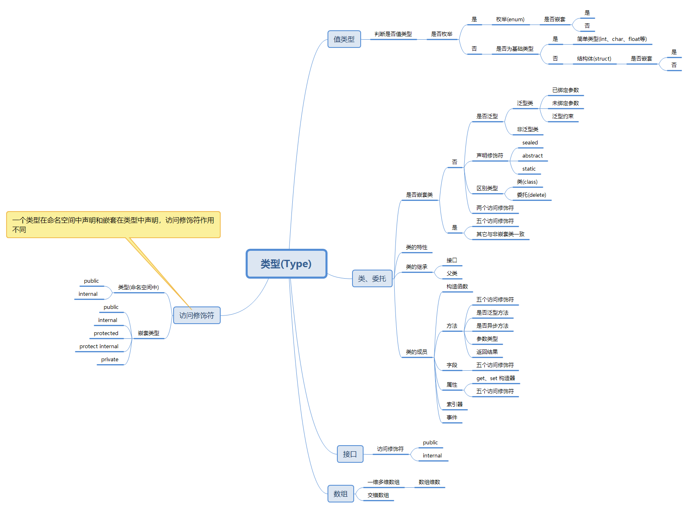
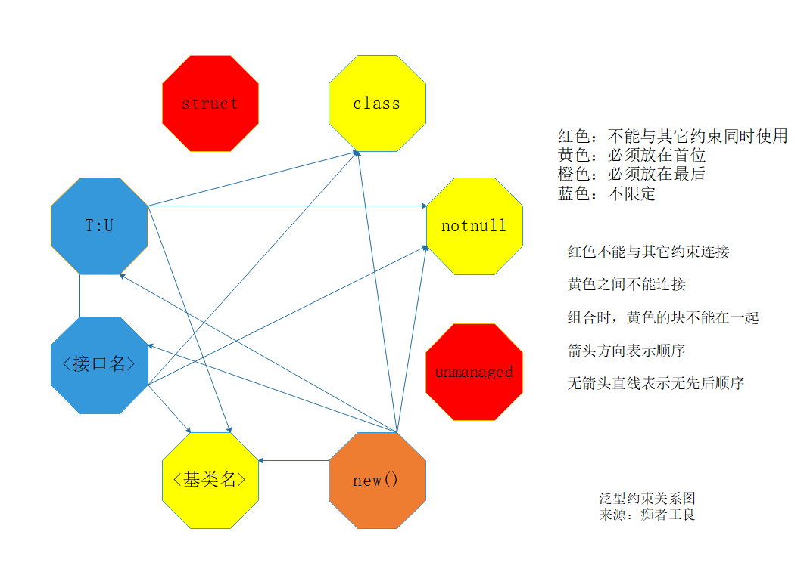
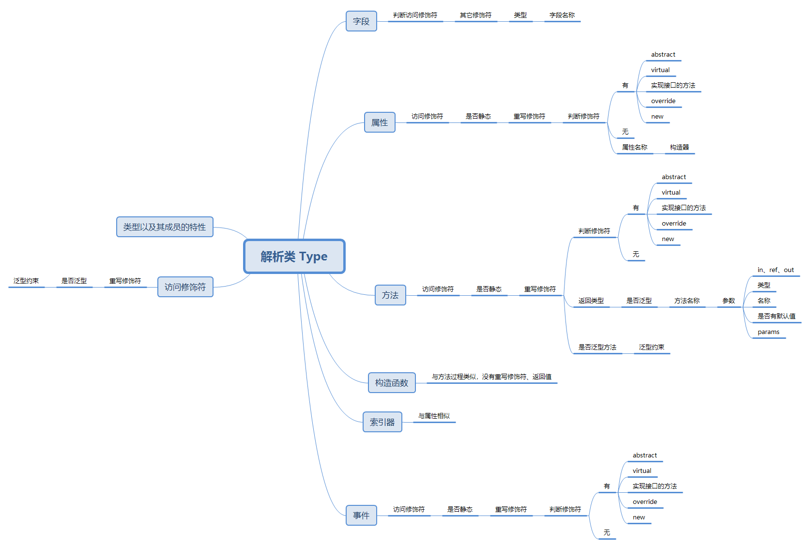
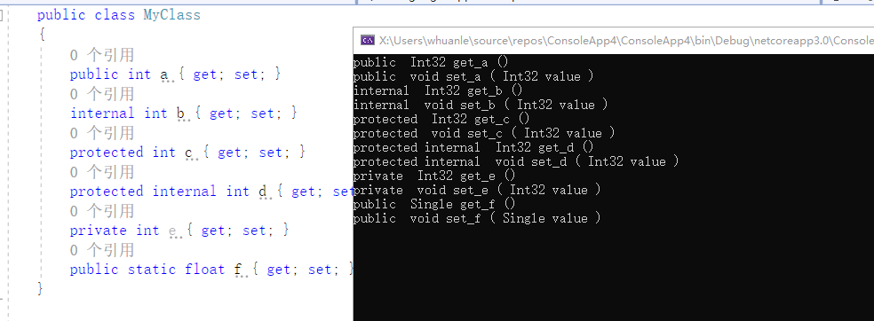

# C#反射与特性(九)：深入反射与运用


本篇主要研究类型、类型成员的各种信息和标识，通过反射的操作将信息解析出来，通过实际需求，学会运用反射获得需要的信息。


在此之前记一下：

C# 中的访问修饰符：public、private、protected、internal、protected internal。

C# 两个成员关键字：readonly、const。

C# 声明修饰符： sealed、static、virtual、new 、abstract、override。

我们根据反射的类型对象，大概分为：类、值类型、数组、结构体、枚举、接口、抽象类、委托、事件、各种泛型(泛型类、泛型方法、泛型构造函数等)。

此文花了我一天半时间，除了写文章外，查看大量文档资料，创建了很多项目，进行了大量测试验证，最终整理出来。

至此此系列已经进行到第九篇啦。


## 1，判断类型

从 Type 中解析类型信息，笔者使用思维导图整理如图




#### 判断是否某种类型

一般来说，如果有两个 Type 对象，要判断两个 Type 所反射的类型，是否为同一种类型，可以使用 `==` 。

```c#
            Type A = typeof(ClassA);
            Type B = typeof(ClassB);
            Console.WriteLine(A == B);
```


### 1.1 类和委托

#### 1.1.1 判断是否类型或委托

`Type.IsClass` 属性可以判断一个类型是否为类或者委托。符合条件的会有普通的类(包括泛型)、抽象类(abstract class)、委托(delegate)。

它可以排除值类型和接口。例如简单值类型、结构体、枚举、接口。


#### 1.1.2 判断是否泛型

`Type.IsGenericType ` 属性可以判断类或委托是否为泛型类型。

`Type.IsGenericTypeDefinition` 属性可以判断 Type 是否是未绑定参数类型的泛型类型。

`Type.IsConstructedGenericType`  属性判断是否可以此 Type 创建泛型实例。

如果是已绑定参数类型的泛型，则可以使用 `Activator.CreateInstance()` 等方式实例化类型。

实验过程：

创建三个类型

```C#
    public delegate void DeA();
    public delegate void DeB<T>(T t);

    public class ClassC<T>
    {
        public ClassC(T t) { }
    }
```

打印输出

```C#
           // 普通委托
            Type typeA = typeof(DeA);
            Console.WriteLine("类型名称：" + typeA.Name);
            Console.WriteLine("是否为类或委托：" + typeA.IsClass);
            Console.WriteLine("是否为泛型：" + typeA.IsGenericType);
            Console.WriteLine("是否已绑定参数类型：" + typeA.IsGenericTypeDefinition);
            Console.WriteLine("可以用此 Type 创建实例：" + typeA.IsConstructedGenericType);


            // 泛型委托，不绑定参数类型
            Type typeB = typeof(DeB<>);
            Console.WriteLine("\n\n类型名称：" + typeB.Name);
            Console.WriteLine("是否为类或委托：" + typeB.IsClass);
            Console.WriteLine("是否为泛型：" + typeB.IsGenericType);
            Console.WriteLine("是否已绑定参数类型：" + typeB.IsGenericTypeDefinition);
            Console.WriteLine("可以用此 Type 创建实例：" + typeB.IsConstructedGenericType);

            // 泛型委托，绑定参数类型
            Type typeBB = typeof(DeB<int>);
            Console.WriteLine("\n\n类型名称：" + typeBB.Name);
            Console.WriteLine("是否为类或委托：" + typeBB.IsClass);
            Console.WriteLine("是否为泛型：" + typeBB.IsGenericType);
            Console.WriteLine("是否已绑定参数类型：" + typeBB.IsGenericTypeDefinition);
            Console.WriteLine("可以用此 Type 创建实例：" + typeBB.IsConstructedGenericType);

            // 泛型类，未绑定参数
            Type typeC = typeof(ClassC<>);
            Console.WriteLine("\n\n类型名称：" + typeC.Name);
            Console.WriteLine("是否为类或委托：" + typeC.IsClass);
            Console.WriteLine("是否为泛型：" + typeC.IsGenericType);
            Console.WriteLine("是否已绑定参数类型：" + typeC.IsGenericTypeDefinition);
            Console.WriteLine("可以用此 Type 创建实例：" + typeC.IsConstructedGenericType);

            // 泛型类型，已绑定参数
            Type typeD = typeof(ClassC<int>);
            Console.WriteLine("\n\n类型名称：" + typeD.Name);
            Console.WriteLine("是否为类或委托：" + typeD.IsClass);
            Console.WriteLine("是否为泛型：" + typeD.IsGenericType);
            Console.WriteLine("是否已绑定参数类型：" + typeD.IsGenericTypeDefinition);
            Console.WriteLine("可以用此 Type 创建实例：" + typeD.IsConstructedGenericType);
```


#### 1.1.3 泛型的参数名称和泛型限定

获取泛型类型定义时，泛型参数的名称

```c#
    public class MyClass<T1,T2,T3,T4,T5> { }
```

```c#
            Type type = typeof(MyClass<,,,,>);

            var types = ((System.Reflection.TypeInfo)type).GenericTypeParameters;
            foreach (var item in types)
            {
                Console.WriteLine(item.Name);
            }
```

输出

```
T1
T2
T3
T4
T5
```

TypeInfo 用于处理各类类型的泛型类型声明。

《[C#反射与特性(四)：实例化类型](https://www.cnblogs.com/whuanle/p/12153304.html)》第三节中，我们探究了泛型的各种实例化方式。


##### 泛型约束

对于类和方法来说，使用泛型版本，可能会进行泛型约束，我们需要将约束解析出来。

Type 中， `GetGenericParameterConstraints` 和 `GenericParameterAttributes` 属性，可以判断约束类型。

| 约束                   | 描述                                                         |
| :--------------------- | :----------------------------------------------------------- |
| `where T : struct`     | 值类型                                                       |
| `where T : class`      | 类型参数必须是引用类型。 此约束还应用于任何类、接口、委托或数组类型 |
| `where T : notnull`    | 类型参数必须是不可为 null 的类型                             |
| `where T : unmanaged`  | 类型参数必须是不可为 null 的非托管类型，跟struct十分相似，但是unmanaged是不安全的。 |
| `where T : new()`      | 类型参数必须具有公共无参数构造函数。 与其他约束一起使用时，`new()` 约束必须最后指定。 `new()` 约束不能与 `struct` 和 `unmanaged` 约束结合使用。 |
| `where T :` <基类名>   | 类型参数必须是指定的基类或派生自指定的基类                   |
| `where T :` <接口名称> | 类型参数必须是指定的接口或实现指定的接口。 可指定多个接口约束。 约束接口也可以是泛型。 |
| `where T : U`          | 为 T 提供的类型参数必须是为 U 提供的参数或派生自为 U 提供的参数 |

`GetGenericParameterConstraints` 可以获取到参数类型，不过只能对 struct、class、<基类名>、<接口名称>、`T : U` 有效。

- 这些约束之间，有着复杂的冲突关系，这里就不一一列举了。
- 而有些类型本身就代表包含多种约束，例如 struct 本身包含 `new()`、`notnull`。
- 有些约束条件是可以互相组合的。

从上面看来，要解析泛型约束，不是容易的事。


##### GenericParameterAttributes 枚举

但是我们来划分一下，针对不同情况下的组合，来理清一下 Type 和  GenericParameterAttributes 的关系。

先看一下 `GenericParameterAttributes` 枚举，此枚举是用来描述泛型类或方法上泛型参数约束的。

```C#
    public enum GenericParameterAttributes
    {
        None = 0,						// 无特殊情况
        Covariant = 1,					// 泛型类型参数是可协变的
        Contravariant = 2,				// 泛型类型参数是逆变的
        VarianceMask = 3,				// Contravariant 和 Covariant 的集合
        ReferenceTypeConstraint = 4,	// 引用类型
        NotNullableValueTypeConstraint = 8,	// 是值类型且不为空
        DefaultConstructorConstraint = 16,	// 无参数构造函数
        SpecialConstraintMask = 28			// 所有特殊标记的集合
    }
```

接下来看看不同约束条件和对应的 `GenericParameterAttributes` 枚举值。


##### 泛型约束关系

泛型约束有各种冲突关系和约束特性，我们来通过表格和图片，一一列举出来。

| 约束                                        | Type     | 枚举值 | 冲突                              | 必须放在开头 |
| ------------------------------------------- | -------- | ------ | --------------------------------- | ------------ |
| <span style="color:red;">struct</span>      | 值类型   | 8,16   | 只能单独使用                      | 是           |
| <span style="color:yellow;">class</span>    |          | 4      | struct,notnull,unmanaged,<基类名> | 是           |
| <span style="color:yellow;">notnull</span>  |          | 0      | struct,class,unmanaged            | 是           |
| <span style="color:red;">unmanaged</span>   | struct   | 8,16   | 只能单独使用                      | 是           |
| <span style="color:orange;">new()</span>    |          | 16     | struct,unmanaged                  | 必须放在最后 |
| <span style="color:yellow;"><基类名></span> | <基类名> | 0      | struct,notnull,unmanaged          | 是           |
| <span style="color:blue;"><接口名></span>   | <接口名> | 0      | struct,unmanaged                  | 否           |
| <span style="color:blue;">T : U</span>      | U        | 0      | struct                            | 否           |

注：`T : U` 使用时虽然不提示与其它约束冲突，如果继承的约束有冲突，可能会在编译时或运行期可能会报错。

<接口名> 编写代码时，不与其它约束冲突，但是实际上有些是不能同时使用的。

`unmanaged, BaseInterFace` 可以用作约束条件，但是 unmanaged 应该是非托管类型，这里我们就不考虑了。

泛型约束关系如图所示：



看完图片后是不是感觉思路很清晰了呢~

泛型约束比较多，他们有多种组合，但是从上图，可以判断组合时：

①(红)

②(黄)(N个蓝)

③(黄)(N个蓝)(橙)

④(任意一种颜色)

⑤(N个蓝色)


由于代码比较多，这里就不显示了，代码已经上传至码云 [解析泛型](https://gitee.com/whuanle/reflection_and_properties/blob/master/解析泛型.cs)


关于泛型的反射，可以参考这里 https://docs.microsoft.com/zh-cn/dotnet/csharp/programming-guide/generics/generics-and-reflection


#### 1.1.4 是否委托

经过前面的操作，已经可以筛选出一个类型是否为类型或委托，那么判断一个类型是否为委托，可以使用 `IsSubclassOf()` ，可以判断一个 Type 是否为委托类型。

`IsSubclassOf()` 可以判断当前 Type 是否派生于 参数中的 Type。

```c#
type.IsSubclassOf(typeof(Delegate));
```

另外，有个多播委托 `MulticastDelegate` ，可以使用

```c#
type.IsSubclassOf(typeof(MulticastDelegate))
```


#### 1.1.5 访问修饰符

在命名空间中说明的类和委托只能使用 public、internal 两个修饰符修饰访问权限。如果不指定的话，默认下是 internal 。

Type 的两个属性 `IsPublic`、`IsNotPublic`可以对此进行识别。

测试：

```c#
    public class A { }
    internal class B { }
    class C { }
```

Main 中输出

```c#
            Type typeA = typeof(A);
            Type typeB = typeof(B);
            Type typeC = typeof(C);

            Console.WriteLine(typeA.Name);
            Console.WriteLine("是否public:    "+typeA.IsPublic);
            Console.WriteLine("是否protected:    " + typeA.IsNotPublic);


            Console.WriteLine("\n"+typeB.Name);
            Console.WriteLine("是否public:    " + typeB.IsPublic);
            Console.WriteLine("是否protected:    " + typeB.IsNotPublic);

            Console.WriteLine("\n" + typeC.Name);
            Console.WriteLine("是否public:    " + typeC.IsPublic);
            Console.WriteLine("是否protected:    " + typeC.IsNotPublic);
```

输出结果

```c#
A
是否public:    True
是否protected:    False

B
是否public:    False
是否protected:    True

C
是否public:    False
是否protected:    True

```


#### 1.1.6 密封类、静态类型、抽象类

密封类是不能被继承的类型，通过 Type 的 `IsSealed` 可以判断。

```c#
    public sealed class A { }
```

```c#
            Console.WriteLine(typeof(A).IsSealed);
```

sealed 也可以修饰委托。

判断是否为抽象类

```c#
    public abstract class MyClass { }
```

```c#
            Console.WriteLine(typeof(MyClass).IsAbstract);
```


定义类时，static、abstract、sealed 任意两个不能在一起调用。

如果一个类是静态类，那么 `IsSealed` 和 `IsAbstract` 都是 true。

Type 中没有判断类是否为静态类的属性或方法，但是可以通过上面的方法判断是否为静态类。

我们可以做一下实验

```c#
    public sealed class A { }
    public abstract class B { }
    public static class C { }
```

```c#
            Type typeA = typeof(A);
            Type typeB = typeof(B);
            Type typeC = typeof(C);

            Console.WriteLine("密封类：");
            Console.WriteLine("IsSealed：" + typeA.IsSealed);
            Console.WriteLine("IsAbstract：" + typeA.IsAbstract);

            Console.WriteLine("\n抽象类类：");
            Console.WriteLine("IsSealed：" + typeB.IsSealed);
            Console.WriteLine("IsAbstract：" + typeB.IsAbstract);

            Console.WriteLine("\n静态类");
            Console.WriteLine("IsSealed：" + typeC.IsSealed);
            Console.WriteLine("IsAbstract：" + typeC.IsAbstract);
```

输出结果

```
密封类：
IsSealed：True
IsAbstract：False

抽象类类：
IsSealed：False
IsAbstract：True

静态类
IsSealed：True
IsAbstract：True

```


#### 1.1.7 嵌套类访问权限

下面是有关于嵌套类型的 Type 的 属性。 类和委托都可以使用。

| 属性                | 说明                                                         |
| ------------------- | ------------------------------------------------------------ |
| IsNested            | 获取一个指示当前 Type 对象是否表示其定义嵌套在另一个类型的定义之内的类型的值。 |
| IsNestedAssembly    | 获取一个值，通过该值指示 Type 是否是嵌套的并且只能在它自己的程序集内可见。 |
| IsNestedFamANDAssem | 获取一个值，通过该值指示 Type 是否是嵌套的并且只对同时属于自己家族和自己程序集的类可见。 |
| IsNestedFamily      | 获取一个值，通过该值指示 Type 是否是嵌套的并且只能在它自己的家族内可见。 |
| IsNestedFamORAssem  | 获取一个值，通过该值指示 Type 是否是嵌套的并且只对属于它自己的家族或属于它自己的程序集的类可见。 |
| IsNestedPrivate     | 获取一个值，通过该值指示 Type 是否是嵌套的并声明为私有。     |
| IsNestedPublic      | 获取一个值，通过该值指示类是否是嵌套的并且声明为公共的。     |


#### 1.1.8 特性

索特性的方式有两种

- 调用 Type 或者 MemberInfo 的 GetCustomAttributes 方法;
- 调用 Attribute.GetCustomAttribute 或者 Attribute.GetCustomAttributes 方法；

《[C#反射与特性(七)：自定义特性以及应用](https://www.cnblogs.com/whuanle/p/12182962.html)》中，对特性的使用做了很详细的介绍，这里不再赘述。


#### 1.1.9 父类、接口

| 属性     | 说明                              |
| -------- | --------------------------------- |
| BaseType | 获取当前 Type直接从中继承的类型。 |

| 方法                 | 说明                                                      |
| -------------------- | --------------------------------------------------------- |
| GetInterface(String) | 搜索具有指定名称的接口。                                  |
| GetInterfaces()      | 当在派生类中重写时，获取由当前 Type实现或继承的所有接口。 |

```c#
            Type type = typeof(List<>);
            Console.WriteLine("List<> 的父类为：" + type.BaseType);

            Console.WriteLine("List<> 继承的接口：");
            Type[] types = type.GetInterfaces();
            foreach (var item in types)
            {
                Console.WriteLine(item.Name);
            }
```


### 1.2 值类型

`Type.IsValueType` 可以判断一个 Type 是否为值类型，简单值类型、结构体、枚举，都符合要求。

`Type.IsEnum` 判断 Type 是否为枚举。

`Type.IsPrimitive` 判断 Type 是否为基础类型。

通过以下过程可以判断一个类型属性何种值类型

```c#
        public enum MyTest
        {
            None = 0,   // 不是值类型
            Enum = 1,   // 枚举
            Struct = 2, // 结构体
            Base = 3    // 基础类型
        }
        public static MyTest Test(Type type)
        {
            if (!type.IsValueType)
                return MyTest.None;

            if (type.IsEnum)
                return MyTest.Enum;

            return type.IsPrimitive ? MyTest.Base : MyTest.Struct;
        }
```


枚举 Type，有如下方法帮助获取枚举信息：

| 方法                    | 说明                                                         |
| ----------------------- | ------------------------------------------------------------ |
| GetElementType()        | 当在派生类中重写时，返回当前数组、指针或引用类型包含的或引用的对象的 Type。 |
| GetEnumName(Object)     | 返回当前枚举类型中具有指定值的常数的名称。                   |
| GetEnumNames()          | 返回当前枚举类型中各个成员的名称。                           |
| GetEnumUnderlyingType() | 返回当前枚举类型的基础类型。                                 |
| GetEnumValues()         | 返回当前枚举类型中各个常数的值组成的数组。                   |


### 1.3 接口

`Type.IsInterface` 属性，判断 Type 是否为接口。


### 1.4 数组

`IsArray` 判断是否为数组，`GetArrayRank()` 获取数组的维数。

通过 `GetElementType` 可以获取数组的元素类型

`IsSZArray` 判断是否为交错数组/锯齿数组，`IsVariableBoundArray` 判断是否为一维或多维数组。

`IsSZArray`  和 `IsVariableBoundArray` 是 .NET Core 2.0 以上、.NET Standard 2.1 以上才有的。

```c#
            Type a = typeof(int[,,,,]);
            Console.WriteLine(a.Name);
            Console.WriteLine("数组元素类型：" + a.GetElementType());
            Console.WriteLine("是否为数组：" + a.IsArray);
            Console.WriteLine("交错数组：" + a.IsSZArray);
            Console.WriteLine("一维或多维数组" + a.IsVariableBoundArray);
            Console.WriteLine("数组维数：" + a.GetArrayRank());


            Console.WriteLine("\n\n");
            Type b = typeof(int[][][][]);
            Console.WriteLine(b.Name);
            Console.WriteLine("数组元素类型：" + b.GetElementType());
            Console.WriteLine("是否为数组：" + b.IsArray);
            Console.WriteLine("交错数组：" + b.IsSZArray);
            Console.WriteLine("一维或多维数组" + b.IsVariableBoundArray);
            Console.WriteLine("数组维数：" + b.GetArrayRank());
```


不过 `GetElementType()` 不能一次性拿到最初的元素类型，`GetArrayRank` 对交错数组也无效。

下面的方法可以快速解析值类型的交错数组。

```C#
        // 只能解析值类型、系统基础类型，例如 int 等
        public static (Type, int) Test(Type type)
        {
            if (!type.IsSZArray)
                return (type, 0);

            int num = 0;
            Type that = type;
            while (true)
            {
                that = that.GetElementType();
                num += 1;
                if (that.IsPrimitive)
                    break;
            }
            return (that, num);
        }
```

调用

```c#
            Type b = typeof(int[][][][]);
			var result = Test(b);
            Console.WriteLine("元素类型：" + result.Item1);
            Console.WriteLine("锯齿数：" + result.Item2);
```


复杂类型的交错数组，可以使用字符串处理。


## 2， 类型成员

通过第一章的操作，已经可以解析程序集的大纲图了，现在开始来获取类型内部的细节，构建更为清晰的信息。

解析类型结构，过程大致如下



### 2.1 类

一个类由以下一个或多个成员组成：

| 成员类型        | 说明                 |
| --------------- | -------------------- |
| PropertyInfo    | 类型的属性信息       |
| FieldInfo       | 类型的字段信息       |
| ConstructorInfo | 类型的构造函数信息   |
| MethodInfo      | 类型的方法           |
| ParameterInfo   | 构造函数或方法的参数 |
| EventInfo       | 类型的事件           |

特性的话，在《C#反射与特性(七)：自定义特性以及应用》已经讲解了，这里不再赘述。


#### 2.1.1 访问修饰符

public、private两个修饰符，判断起来十分简单；

C# 关键字 `protected` 和 `internal` 在 IL 中没有任何意义，且不会用于反射 API 中。也就是说在反射中看来，这两个访问修饰符没作用；不过对于获取信息来说，还是需要想办法解析。

protected、internal、protected internal 对于反射调用来说，是没有意义的，不过对于获取信息来说，还是需要想办法解析。

判断是否为 `internal`  可以使用 `IsAssembly` ；判断是否为 `protected internal` ，可以使用`IsFamilyOrAssembly` ；两个属性一起用，结果都是 `false` 的话，则是 `protected`。

| 属性               | 说明                          |
| ------------------ | ----------------------------- |
| IsAssembly         | 是否为 internal               |
| IsFamily           | 是否为 protected              |
| IsFamilyOrAssembly | 判断是否为 protected internal |

注：` protected internal`、`internal protected` 是一样的。

下面方法可以判断并且返回访问修饰符名称

```c#
        public static string Visibility(FieldInfo field)
        {
            return
                field.IsPublic ? "public" :
                field.IsPrivate ? "private" :
                field.IsAssembly ? "internal" :
                field.IsFamily ? "protected" :
                field.IsFamilyOrAssembly ? "protected internal" :
                null;
        }
```


#### 2.1.2 其它修饰符

readonly、static、const 三个修饰符，const 不能与其它修饰符同时存在。

| 属性       | 说明                                                         |
| ---------- | ------------------------------------------------------------ |
| IsLiteral  | 获取一个值，通过该值指示该值是否在编译时写入并且不能更改     |
| IsStatic   | static 修饰的字段，注意 const 也属于 static。                |
| IsInitOnly | 获取一个值，通过该值指示此字段是否只能在构造函数的主体中设置 |

下面的方法可以判断、返回相应的修饰符

```c#
        public static string Only(FieldInfo field)
        {
            if (field.IsLiteral)
                return "const";
            if (field.IsStatic && field.IsInitOnly)
                return "readonly static";
            if (field.IsStatic)
                return "static";
            if (field.IsInitOnly)
                return "readonly";

            return string.Empty;
        }
```

`const int a;` 使用 `IsStatic` 结果为 `true`，因为 const 也属于 static。 

#### 2.1.3 字段

通过 2.1.1 和 2.1.2 ，可以解析字段的信息了。

下面来测试一下。

定义一个类型

```c#
    public class MyClass
    {
        public int a;
        internal int b;
        protected int c;
        protected internal int d;
        private int e;
        public readonly static float f = 1;
    }
```

输出解析数据

```C#
            Type type = typeof(MyClass);
            FieldInfo[] fields = type.GetFields(BindingFlags.Public | BindingFlags.NonPublic | BindingFlags.GetField | BindingFlags.Static | BindingFlags.Instance);
            IEnumerable<FieldInfo> fields1 = type.GetRuntimeFields();
            foreach (var item in fields)
            {
                StringBuilder builder = new StringBuilder();
                builder.Append(GetVisibility(item) + " ");
                builder.Append(GetRead(item) + " ");
                builder.Append(item.FieldType.Name + " ");
                builder.Append(item.Name + " ;");
                Console.WriteLine(builder.ToString());
            }
```


因为反射的显示信息的话，主要是显示元数据，而且 `{get;set;}` 属性会自动生成私有字段，所以上面的代码会将这些也显示出来。将获取条件改成 `BindingFlags.Public | BindingFlags.GetField | BindingFlags.Static | BindingFlags.Instance` 。


#### 2.1.4 方法、参数


##### 排除属性的方法

当我们编写一个属性，编译时，编译器会生成对应的 get 和 set 方法，我们一般来说，只是需要显示程序员编写的方法，而非系统生成的。

系统生成的属性的方法，会带有一个 `System.Runtime.CompilerServices.CompilerGeneratedAttribute` 特性，通过此特性可以排除系统生成的方法。

```c#
        public static bool IsPropertyOfAttr(MethodInfo method)
        {
            return method.GetCustomAttributes().Any(x => x.GetType() == typeof(System.Runtime.CompilerServices.CompilerGeneratedAttribute));
        }
```


##### 方法的访问修饰符

判断方法访问修饰符的代码如下

```C#
        public static string GetVisibility(MethodInfo method)
        {
            return
                method.IsPublic ? "public" :
                method.IsPrivate ? "private" :
                method.IsAssembly ? "internal" :
                method.IsFamily ? "protected" :
                method.IsFamilyOrAssembly ? "protected internal" :
                null;
        }
```

前面已经进行了相应的讲解，这里不在赘述。


##### 重写与隐藏关键字

方法，可以有以下关键字修饰：virtual、override、abstract、new；

从继承关系上来说，分类上，一个方法可能是 virtual、abstract；然后继承后，重写 virtual 修饰的方法可能是 override 、 new；abstract 修饰的方法只能使用 override 。

以下属性可以区分修饰符：

`IsAbstract`、`IsVirtual` 、`IsHideBySig`，`IsFinal`。

virtual、override、abstract、new 修饰的方法，`IsHideBySig`  结果都是 true，可用此属性判断方法是否有抽象、重写等关键字修饰。

对于 virtual、override 修饰的方法，`IsVirtual`  为 true，new 修饰的方法 `IsVirtual`  为 flase。

但是一个方法，如果是实现了接口方法的话，使用 `IsVirtual` 也会返回 `true`，`IsHideBySig`  也会返回 true。

那么就剩下区分 `virtual` 、 `override` 了，如果当前方法是重写了父类的，使用`MethodInfo.GetBaseDefinition()` 可以返回当前方法的所重写父类的方法；如果没有重写，那么就返回方法本身。

`IsVirtual` 可以判断当前方法是否可以被重写。 

但是但是，一个在当前类中定义的，类似 `public string Test(){}` 的方法，可以被重写，很容易被判断为 new。需要在最后做个判断。

当获取到一个 MethodInfo 时，要区分上面的修饰符，可以使用以下代码流程。

```c#
        // virtual override  abstract new
        public static string IsOver(Type type,MethodInfo method)
        {
            // 没有相应的信息，说明没有使用以上关键字修饰
            if (!method.IsHideBySig)
                return string.Empty;

            // 是否抽象方法
            if (method.IsAbstract)
                return "abstract";

            // virtual、override、实现接口的方法
            if (method.IsVirtual)
            {
                // 实现接口的方法
                if (method.IsFinal)
                    return string.Empty;
                // 没有被重写，则为 virtual
                if (method.Equals(method.GetBaseDefinition()))
                    return "virtual";
                else
                    return "override";
            }
            // new
            else
            {
                // 如果是当前类型中定义的方法，则只是一个普通的方法
                if (type == method.DeclaringType)
                    return string.Empty;

                return "new";
            }
        }
```


##### 获取返回类型

可以从  `ReturnParameter`、`ReturnType`和 `ReturnTypeCustomAttributes` 获取有关返回类型的信息。

`ReturnTypeCustomAttributes`  是获取特性信息的，这里先不处理。

```C#
        // 获取返回类型
        public static string GetReturn(MethodInfo method)
        {
            Type returnType = method.ReturnType;
            ParameterInfo returnParam = method.ReturnParameter;

            if (returnType == typeof(void))
                return "void";
            if (returnType.IsValueType)
            {
                // 判断是否 (type1,type2) 这样的返回
                if (returnParam.ParameterType.IsGenericType)
                {
                    Type[] types = returnParam.ParameterType.GetGenericArguments();
                    string str = "(";
                    for (int i = 0; i < types.Length; i++)
                    {
                        str += types[i].Name;
                        if (i < types.Length - 1)
                            str += ",";
                    }
                    str += ")";
                    return str;
                }
                return returnType.Name;
            }

            // 这里暂不处理复杂的返回类型，例如数组,泛型等。
            return returnType.Name;
        }
```

`method.ReturnType` 和 `method.ReturnParameter.ParameterType` 是一样的。

一般使用 `ReturnType` 就行了，有些特殊的语法要使用 `ReturnParameter` 。

笔者暂时没有碰到有区分的使用场景。

##### 是否异步方法

使用以下代码判断是否异步方法

```c#
        public static string GetAsync(MethodInfo info)
        {
            return info.GetCustomAttribute(typeof(AsyncStateMachineAttribute))==null?"":"async ";
        }
```


##### 泛型方法

通过以下代码可以判断是否为泛型方法，并且返回名称。

```c#
        // 判断方法是否为泛型方法，并且返回泛型名称
        public static string GetMethodName(MethodInfo method)
        {
            if (!method.IsGenericMethod)
                return method.Name;
            Type[] types = method.GetGenericArguments();
            string str = method.Name + "<";
            for (int i = 0; i < types.Length; i++)
            {
                str += types[i].Name;
                if (i < types.Length - 1)
                    str += ",";
            }
            str += ">";
            return str;
        }
```


##### 方法参数

步骤一：判断参数是否有 in、ref、out 修饰，如果是的话，类型名称后面会带有字符 `&` ；params 的话，会带有一个 `ParamArrayAttribute` 特性。

步骤二：获取参数类型；如果是 in、ref、out 修饰的话，类型名称后面会带有一个 `&`，需要去除；

步骤三：是否具有默认值，如果存在默认值的话，就返回默认值。


```c#
        // 解析方法的参数
        public static string GetParams(MethodInfo method)
        {
            ParameterInfo[] parameters = method.GetParameters();
            if (parameters.Length == 0)
                return string.Empty;

            int length = parameters.Length - 1;
            StringBuilder str = new StringBuilder();
            for (int i = 0; i <= length; i++)
            {
                str.Append(InRefOut(parameters[i]) + " ");
                // 这里不对复杂类型等做处理
                str.Append(GetParamType(parameters[i]) + " ");
                str.Append(parameters[i].Name);
                str.Append(HasValue(parameters[i]) + " ");
                if (i < length)
                    str.Append(",");
            }
            return str.ToString();
        }

        public static string InRefOut(ParameterInfo parameter)
        {
            // in、ref、out ，类型后面会带有 & 符号
            if (parameter.ParameterType.Name.EndsWith("&"))
            {
                return
                    parameter.IsIn ? "in" :
                    parameter.IsOut ? "out" :
                    "ref";
            }
            if (parameter.GetCustomAttributes().Any(x => x.GetType() == typeof(ParamArrayAttribute)))
                return "params";
            return string.Empty;
        }

        // 获取类型
        public static string GetParamType(ParameterInfo parameter)
        {
            string typeName = parameter.ParameterType.Name;
            if (typeName.EndsWith("&"))
                typeName = typeName.Substring(0, typeName.Length - 1);
            return typeName;
        }

        // 是否为可选参数，是否有默认值
        public static string HasValue(ParameterInfo parameter)
        {
            if (!parameter.IsOptional)
                return string.Empty;
            object value = parameter.DefaultValue;
            return " = " + value.ToString();
        }
```


#### 学以致用

学习如何获取、解析方法的信息后，我们可以在这里实践一下。

定义以下类型，我们最终需要的是 MyClass。

```c#
    interface A
    {
        void TestA();
    }
    public abstract class B
    {
        public abstract void TestB();
    }
    public abstract class C : B
    {
        public virtual void TestC()
        {
        }
        public virtual void TestD()
        {
        }
    }
    public class MyClass : C, A
    {
        public void TestA()
        {
            throw new NotImplementedException();
        }

        public override void TestB()
        {
            throw new NotImplementedException();
        }
        public override void TestC()
        {
            base.TestC();
        }
        new public void TestD()
        {

        }
        public (bool, bool) TestE()
        {
            return (true, true);
        }
        public string TestF<T>(T t)
        {
            return t.GetType().Name;
        }
        public string TestG(in string a, ref string aa, out string b, string c = "666")
        {
            b = "666";
            return string.Empty;
        }
        public string TestH(params string[] d)
        {
            return string.Empty;
        }
    }
```

将 2.1.4 出现的解析方法，复制粘贴到项目中，使用以下代码即可解析出一个类中的方法。

```C#
            Type type = typeof(MyClass);
            MethodInfo[] methods = type.GetMethods(BindingFlags.Public | BindingFlags.Static | BindingFlags.DeclaredOnly | BindingFlags.Instance);

            foreach (MethodInfo item in methods)
            {
                StringBuilder builder = new StringBuilder();
                builder.Append(GetVisibility(item) + " ");
                builder.Append(item.GetGetMethod(true).IsStatic ? "static " : string.Empty);
                builder.Append(IsOver(type, item) + " ");
                builder.Append(GetReturn(item) + " ");
                builder.Append(GetMethodName(item) + " ");
                builder.Append("(" + GetParams(item) + ")");
                Console.WriteLine(builder.ToString());
            }
```

这里不对泛型和数组等复杂类型进行解析，也不输出特性。

可以尝试将 MyClass 换成 List<> 等类型进行测试。

输出效果：

```
public  void TestA ()
public override void TestB ()
public override void TestC ()
public  void TestD ()
public  (Boolean,Boolean) TestE ()
public  String TestF<T> ( T t )
public  String TestG (in String a ,ref String aa ,out String b , String c = 666 )
public  String TestH (params String[] d )
```

完整代码已上传到码云，点击查看 [解析方法与参数](https://gitee.com/whuanle/reflection_and_properties/blob/master/解析方法与参数.cs) 。


#### 2.1.5 构造函数


构造函数的话，没有返回类型，也没有重写，获取参数方法的部分，

因为有很多跟 2.1.4 重复的代码，因此这里不再赘述，代码已经上传到码云，可以参考 [解析构造函数](https://gitee.com/whuanle/reflection_and_properties/blob/master/解析构造函数.cs) 。


#### 2.1.6 属性

正常来说呢，这样写属性是可以的，但是过多的修饰符对属性来说是没意义的。

```c#
    public class MyClass
    {
        public int a { get; set; }
        internal int b { get; set; }
        protected int c { get; set; }
        protected internal int d { get; set; }
        private int e { get; set; }
        public  static float f { get; set; } = 1;
    }
```

`PropertyInfo` 没有像 `FieldInfo` 那么丰富的判断修饰符的属性。

但是呢，获取到属性的方法，则可以获取访问修饰符。




#### 获取访问修饰符

跟获取方法的访问修饰符一样，稍微调整以下即可。

```C#
        public static string GetVisibility(PropertyInfo property)
        {
            MethodInfo method = property.GetGetMethod();
            return
                method.IsPublic ? "public" :
                method.IsPrivate ? "private" :
                method.IsAssembly ? "internal" :
                method.IsFamily ? "protected" :
                method.IsFamilyOrAssembly ? "protected internal" :
                null;
        }
```


#### 获取重写关键字

```c#
            // virtual override  abstract new
            public static string IsOver(Type type, PropertyInfo property)
            {
                MethodInfo method = property.GetGetMethod(true);
                // 没有相应的信息，说明没有使用以上关键字修饰
                if (!method.IsHideBySig)
                    return string.Empty;

                // 是否抽象方法
                if (method.IsAbstract)
                    return "abstract";

                // virtual、override、实现接口的方法
                if (method.IsVirtual)
                {
                    // 实现接口的方法
                    if (method.IsFinal)
                        return string.Empty;
                    // 没有被重写，则为 virtual
                    if (method.Equals(method.GetBaseDefinition()))
                        return "virtual";
                    else
                        return "override";
                }
                // new
                else
                {
                    // 如果是当前类型中定义的方法，则只是一个普通的方法
                    if (type == method.DeclaringType)
                        return string.Empty;

                    return "new";
                }
            }
```


#### 解析属性构造器

```C#
            // 解析属性的构造器
            public static string GetConstructor(PropertyInfo property)
            {
                string str = "{ ";
                if (property.CanRead)
                    str += "get; ";
                if (property.CanWrite)
                    str += "set; ";
                str += "}";
                return str;
            }
```


反射是无法直接拿到属性的默认值的，详细请参考 https://www.ojit.com/article/3058539。

以上，测试代码，可以到码云查看 [解析属性](https://gitee.com/whuanle/reflection_and_properties/blob/master/解析属性.cs)


#### 2.1.7 事件

本节沿用 2.1.4 中解析方法的所有函数。

定义委托和事件如下

```C#
    public delegate void DeTest();
    public abstract class A
    {
        public abstract event DeTest TestA;
    }
    public abstract class B : A
    {
        public virtual event DeTest TestB;
        public event DeTest TestC;
    }
    public class MyClass : B
    {
        public override event DeTest TestA;
        public override event DeTest TestB;
        new public event DeTest TestC;
    }
```

解析事件过程

```C#
            Type type = typeof(MyClass);
            EventInfo[] events = type.GetEvents(BindingFlags.Public | BindingFlags.Static | BindingFlags.DeclaredOnly | BindingFlags.Instance);
            foreach (var item in events)
            {
                MethodInfo method = item.GetAddMethod();
                StringBuilder builder = new StringBuilder();
                builder.Append(GetVisibility(method) + " ");
                builder.Append(method.IsStatic ? "static " : string.Empty);
                builder.Append(IsOver(type, method) + " ");
                builder.Append("event ");
                builder.Append(item.EventHandlerType.Name + " ");
                builder.Append(item.Name + ";");
                Console.WriteLine(builder.ToString());
            }
```

解析过程是非常简单的。


#### 2.1.8 索引器

我们定义一个类型和索引器如下

```c#
    public class MyClass
    {
        private string[] MyArray;
        public MyClass()
        {
            MyArray = new string[] { "a", "b", "c", "d", "e" };
        }
        // 这里不处理 search
        public string this[int index,string search]
        {
            get
            {
                return MyArray[index];
            }
            set
            {
                MyArray[index] = value;
            }
        }
    }
```

索引器在编译时，会生成属性和方法，所以使用反射获取属性时，会把索引器生成的属性包含在内。

构造器会自动生成一个 `public string Item { get; set; }` 的属性。

本节使用 2.1.6 中解析属性的代码。

将属性获取方法优化如下，会区分输出类型中的属性和构造器。

```c#
            Type type = typeof(MyClass);
            PropertyInfo[] properties = type.GetProperties(BindingFlags.Public | BindingFlags.Static | BindingFlags.NonPublic | BindingFlags.DeclaredOnly | BindingFlags.Instance);

            foreach (PropertyInfo item in properties)
            {
                StringBuilder builder = new StringBuilder();
                builder.Append(GetVisibility(item) + " ");
                builder.Append(item.GetGetMethod(true).IsStatic ? "static " : string.Empty);
                builder.Append(IsOver(type, item) + " ");
                builder.Append(item.PropertyType + " ");
                if (item.Name == "Item")
                {
                    builder.Append("this[");
                    ParameterInfo[] paras = item.GetIndexParameters();
                    int length = paras.Length - 1;
                    for (int i = 0; i <= length; i++)
                    {
                        builder.Append(paras[i].ParameterType.Name + " " + paras[i].Name);

                        if (i < length)
                            builder.Append(",");
                    }
                    builder.Append("]");
                }
                else
                {
                    builder.Append(item.Name + " ");
                    builder.Append(GetConstructor(item));
                }

                Console.WriteLine(builder.ToString());
            }
```


#### 2.1.9 获取特性

类型、方法、属性、字段等，都可以使用特性修饰，我们要通过反射获取特性后，还要将特性结果还原出程序员写代码时设置的值。

代码如下

```C#
        /// <summary>
        /// 解析输出类型、方法、属性、字段等特性
        /// </summary>
        /// <param name="attrs"></param>
        /// <returns></returns>
        public static string[] GetAttrs(IList<CustomAttributeData> attrs)
        {
            List<string> attrResult = new List<string>(); ;
            foreach (var item in attrs)
            {
                Type attrType = item.GetType();
                string str = "[";
                str += item.AttributeType.Name;
                // 构造函数中的值
                IList<CustomAttributeTypedArgument> customs = item.ConstructorArguments;
                // 属性的值
                IList<CustomAttributeNamedArgument> arguments = item.NamedArguments;

                // 没有任何值
                if (customs.Count == 0 && arguments.Count == 0)
                {
                    attrResult.Add(str + "]");
                    continue;
                }
                str += "(";
                if (customs.Count != 0)
                {
                    str += string.Join(",", customs.ToArray());
                }
                if (customs.Count != 0 && arguments.Count != 0)
                    str += ",";

                if (arguments.Count != 0)
                {
                    str += string.Join(",", arguments.ToArray());
                }
                str += ")";
                attrResult.Add(str);
            }
            return attrResult.ToArray();
        }
```

调用：

```C#
            Type type = typeof(List<>);
            string[] list = GetAttrs(type.GetCustomAttributesData());
            foreach (var item in list)
            {
                Console.WriteLine(item);
            }

```

调用时，将 Type 改成 MethodInfo 等。

输出：

```
[SerializableAttribute]
[DebuggerDisplayAttribute("Count = {Count}")
[NullableAttribute((Byte)0)
[DebuggerTypeProxyAttribute(typeof(System.Collections.Generic.ICollectionDebugView`1))
[NullableContextAttribute((Byte)1)
[DefaultMemberAttribute("Item")
[TypeForwardedFromAttribute("mscorlib, Version=4.0.0.0, Culture=neutral, PublicKeyToken=b77a5c561934e089")
```


### 2.2 委托

这里使用 2.1.4 中，解析方法的代码。

委托中，会有很多个方法，其中有个 `invoke` 方法，对应定义委托时的各种信息。

```c#
        /// <summary>
        /// 解析委托，包括嵌套类型中的委托
        /// </summary>
        /// <param name="type"></param>
        /// <returns></returns>
        public static string GetDelegateInfo(Type type)
        {
            if (!type.IsSubclassOf(typeof(Delegate)))
                return null;

            string str = "";
            MethodInfo method = type.GetMethod("Invoke");

            if (type.IsNested)
                str += GetVisibility(method);
            else
                str += (type.IsPublic ? "public" : "internal") + " ";
            str += type.IsSealed && type.IsAbstract ? "static " : string.Empty;
            str += "delegate ";
            str += GetReturn(method) + " ";
            str += type.Name;
            str += "(";
            str += GetParams(method);
            str += ")";

            return str;
        }
```


### 2.3 接口

上面已经解析类、抽象类、委托等，可以使用同样的方法解析接口，然后接着解析接口的属性、方法。

这里不再赘述。


### 2.4 可空类型

判断一个类型是否为可空类型时，可以先判断是否为泛型。

可空类型和泛型方法都可以使用 `IsGenericType` 属性判断。

`GetGenericTypeDefinition` 方法可以获取泛型未绑定参数的版本。

最后判断类型是否为 ` typeof(Nullable<>)` ，即可完成整体解析。

```c#
        /// <summary>
        /// 获取可空类型名称
        /// </summary>
        /// <returns></returns>
        public static string GetAbleNullName(Type type)
        {
            if (!type.IsGenericType)
                return type.Name;

            if (type.GetGenericTypeDefinition() == typeof(Nullable<>))
            {
                Type nullType = type.GetGenericArguments().FirstOrDefault();
                return nullType.Name + "?";
            }
            return type.Name;
        }
```